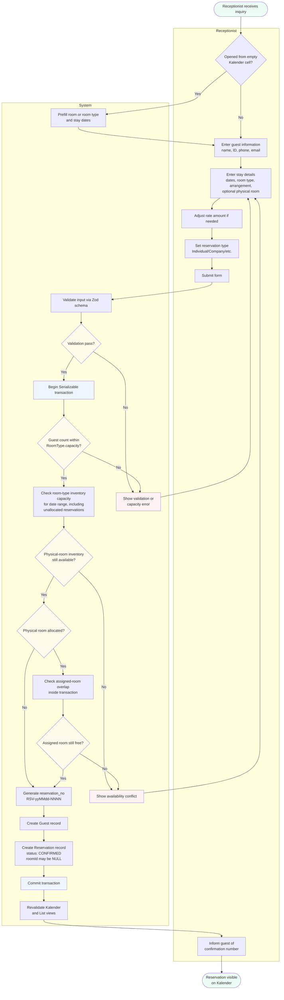
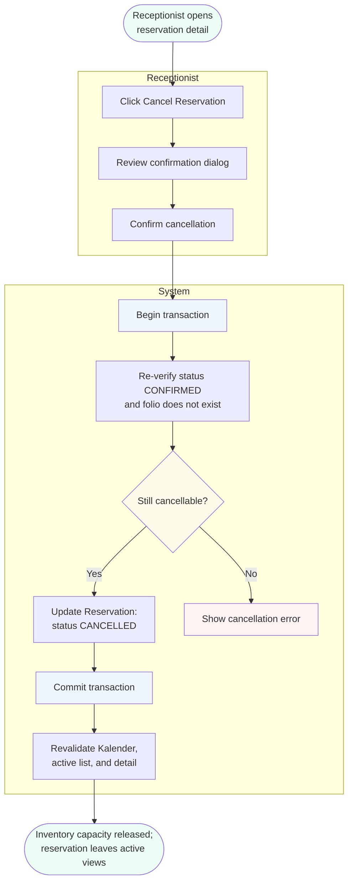
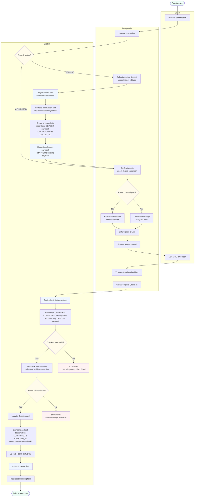
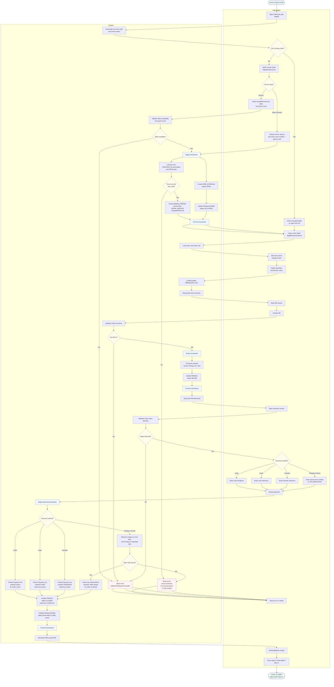
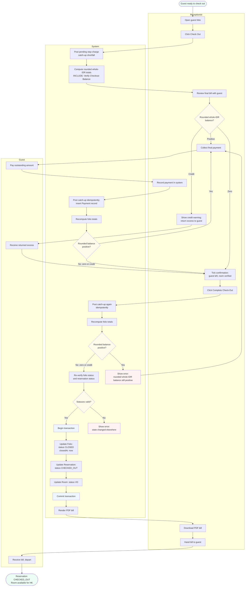
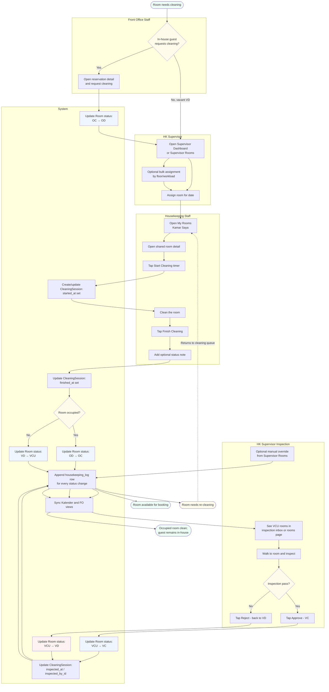
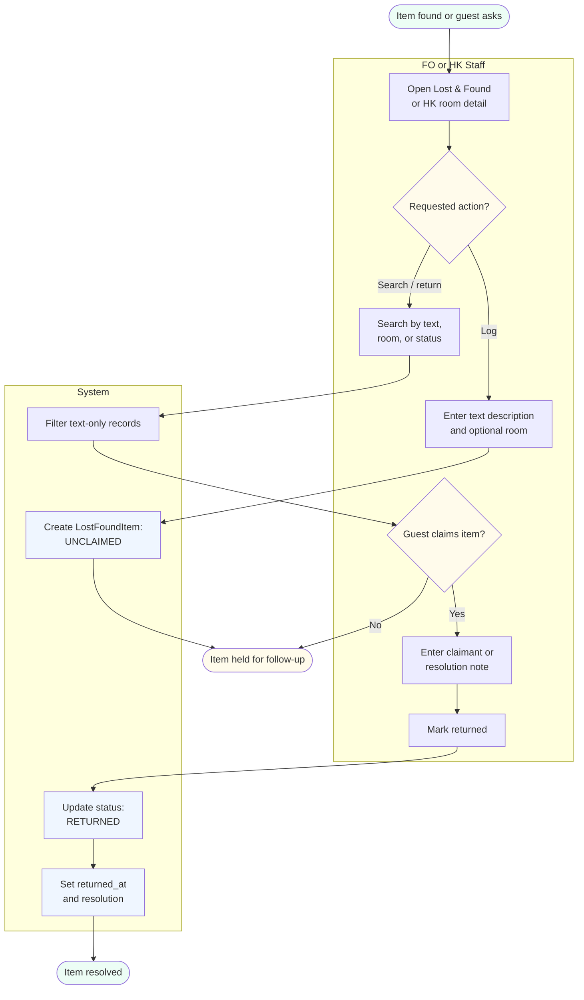
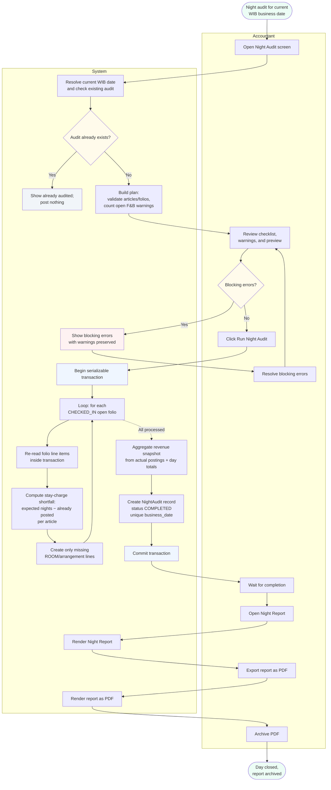

# Activity Diagrams (MVP)

UML-style activity diagrams for the main use cases. Each diagram shows the step-by-step flow of a single operation including decision points, parallel paths, and which actor (or the system) performs each step.

This document complements [use_case_narrative_mvp.md](./use_case_narrative_mvp.md) (use case overview) and [business_process_mvp.md](./business_process_mvp.md) (cross-process workflows). Where business processes are wide and shallow, activity diagrams are narrow and deep — they describe one use case at a time with full internal logic.

Diagrams use Mermaid flowchart syntax with subgraphs representing actor lanes (an approximation of UML swim lanes). View inline on GitHub or paste into [mermaid.live](https://mermaid.live).

---

## 1. Process Reservation (Create)

**Use case:** UC-FO-01 Kelola Reservasi (Create)
**Actors:** Front Office staff (Receptionist), System
**Trigger:** Guest inquiry, walk-in, or Kalender empty-cell click

**Key logic:**

- **Optional allocation:** a reservation may be saved with `roomId = NULL`. If creation starts from an empty Kalender cell, room or room-type and date inputs are prefilled; the receptionist can still leave the physical room unallocated.
- **Two capacity meanings:** `RoomType.capacity` limits guests per room. Overbooking prevention uses inventory capacity: the number of physical rooms registered for the selected room type. Active unallocated reservations consume that inventory too.
- **Defensive checks inside the transaction:** inventory capacity and any assigned-room overlap are checked again inside the Serializable transaction before Guest and Reservation rows are created.
- **Reservation number generation:** the `RSV-yyMMdd-NNNN` format uses the hotel date plus a sequential counter for the day. The counter is computed inside the transaction to prevent race conditions if two reservations are created simultaneously.

---

## 2. Cancel Confirmed Reservation

**Use case:** UC-FO-02 Batalkan Reservasi
**Actors:** Front Office staff (Receptionist), System
**Trigger:** Receptionist cancels a reservation from its detail screen
**Precondition:** Reservation status is CONFIRMED and no folio exists

**Key logic:**

- **Restricted transition:** only `CONFIRMED → CANCELLED` is allowed. Checked-in and checked-out stays cannot use this flow.
- **Capacity release:** cancelled reservations no longer count toward room-type inventory capacity and are omitted from the default active Kalender and reservation-list views.
- **Transactional guard:** status and folio absence are re-checked inside the transaction to handle concurrent operations safely.

---

## 3. Process Check-in

**Use case:** UC-FO-03 Proses Check-in
**Actors:** Front Office staff (Receptionist), Guest, System
**Trigger:** Guest arrives at the hotel on or after the reservation's arrival date
**Precondition:** Arrival date ≤ today. At check-in commit, the reservation must still be `CONFIRMED`, its deposit must be `COLLECTED`, its folio must exist, and that folio must contain the matching `DEPOSIT`-purpose payment.

**Key logic:**

- **Required collection before check-in:** every reservation's deposit is the server-resolved first `ReservationNight.rateAmount`; the client cannot edit it. On or after arrival, Front Office must collect it before check-in. `PENDING` blocks check-in with no waiver or override.
- **Single idempotent collection writer:** the canonical serializable collection transaction creates or reuses the folio, records one matching `DEPOSIT`-purpose payment, and atomically compare-and-sets `PENDING → COLLECTED`. A retry returns the existing payment without creating a duplicate.
- **Required digital GRC signature:** the guest signs on screen before submission. The check-in transaction saves the signed GRC with the reservation update, and the GRC PDF embeds the captured signature.
- **Defensive re-verification:** check-in re-checks `CONFIRMED`, `COLLECTED`, the existing folio, its matching deposit payment, and room availability inside the transaction, then compare-and-sets `CONFIRMED → CHECKED_IN`.
- **Separate atomic responsibilities:** collection owns folio and deposit-payment creation. Check-in atomically updates Guest, Reservation, and Room state; it never collects the deposit or creates the folio.
- **Group behavior:** bulk collection invokes the same writer independently for each eligible sibling. Group batch check-in never collects deposits; it skips `PENDING` siblings and processes only eligible `COLLECTED` siblings.

---

## 4. Process F&B Order

**Use case:** UC-FB-01 Create Captain Order, UC-FB-02 Process F&B Bill, UC-FB-03 Proses Pembayaran F&B
**Actors:** F&B staff (Waiter), System
**Trigger:** Guest sits at a restaurant table, an in-house guest requests room service, or waiter opens an existing order
**Precondition:** Dine-in table is AVAILABLE/RESERVED, or room-service room has a CHECKED_IN reservation with an OPEN folio

**Key logic:**

- **Route coverage:** the shipped flow moves through `/app/fb`, `/app/fb/orders/new`, `/app/fb/orders/[orderId]`, `/app/fb/orders/[orderId]/bill`, and `/app/fb/orders/[orderId]/payment`.
- **Dine-in table locking at order creation:** the system validates the selected table and creates the OPEN `DINE_IN` FBOrder in one transaction, then marks the RestaurantTable OCCUPIED. This prevents two waiters from opening competing orders on the same table.
- **Room-service order creation:** `/app/fb/orders/new?service=room-service` validates room number → CHECKED_IN reservation → OPEN folio inside the create transaction, then creates an OPEN `ROOM_SERVICE` FBOrder with `tableId`/`tableNo` null and `chargedFolioId` set. Rooms without an in-house guest or open folio are rejected.
- **Captain Order before billing:** menu items are stored as FBOrderItem rows while the order is OPEN. The bill cannot be generated until at least one item exists.
- **Bill locks totals:** confirming the bill computes subtotal, service charge, tax, and total from hotel settings, then changes the order from OPEN to BILLED. Payment is only allowed from BILLED state.
- **Four payment paths:** cash, card, and transfer create Payment rows linked to the FBOrder. Charge-to-room validates an in-house guest and OPEN folio for dine-in, or uses the already-attached folio for room service, then creates one FolioLineItem with `fb_order_id` linked to the originating order.
- **Close and free table:** successful payment updates FBOrder to CLOSED and frees the RestaurantTable back to AVAILABLE only when the order has a table. Room-service orders are tableless and do not affect the floor plan. Receipt PDF generation happens after the transactional state change.

---

## 5. Process Check-out (with «include» Verify Checkout Balance)

**Use case:** UC-FO-04 Proses Check-out with «include» Verifikasi Saldo Check-out
**Actors:** Front Office staff (Receptionist), Guest, System
**Trigger:** Guest is ready to leave, or departure date is reached
**Precondition:** Reservation status is CHECKED_IN, folio status is OPEN

**Key logic:**

- **«include» Verify Checkout Balance:** the verification runs whenever check-out is attempted. Before judging the balance, the server posts any pending stay-charge shortfall the night audit has not posted yet and computes the folio in rounded whole IDR. A positive balance blocks check-out; zero or credit may proceed. Charges posted before a blocked attempt remain visible as the true outstanding balance.
- **Payment iteration loop:** if the rounded whole-IDR balance remains positive after a payment, the system recomputes the folio and requires another payment. This supports multiple payment methods, such as partial cash followed by partial card.
- **Three state changes in commit:** Folio close, Reservation flip, Room flip. The PDF generation happens AFTER commit — it's a side effect, not part of the transactional state change.
- **Credit balance handling:** if the rounded whole-IDR balance is negative, check-out proceeds without further payment. The system shows a credit warning and instructs the receptionist to return the excess to the guest; the MVP does not post an automated refund transaction.

---

## 6. Update Room Status

**Use case:** UC-HK-02 Clean Assigned Room with timer and VCU inspection workflow
**Actors:** Front Office staff, Housekeeping staff, Housekeeping supervisor, System
**Trigger:** HK sees an assigned vacant dirty room after check-out, or FO requests cleaning for an in-house room

**Key logic:**

- **CleaningSession is the workflow source:** assignment, timer start, finish, and inspection are read from `cleaning_session`. Active cleaning is derived from `started_at IS NOT NULL AND finished_at IS NULL`; duration is derived from `finished_at - started_at`.
- **HousekeepingLog is the audit trail:** every room-status change appends a `housekeeping_log` row with old status, new status, actor, timestamp, and optional status note. It is not the source for active timer state.
- **Occupied-room loop:** FO can request cleaning from an in-house reservation detail, changing the room from `OC → OD`. When HK stops cleaning an occupied room, the room returns directly to `OC`.
- **Vacant-room inspection:** stopping cleaning for a vacant dirty room changes `VD → VCU`. Inspection then approves `VCU → VC` or rejects `VCU → VD`.
- **Supervisor tier:** inspection, assignment, bulk assignment, Daily List print, and manual override are gated to HK users with `User.isSupervisor = true`. ADMIN has no HK access. Housekeepers clean only their operational worklist.
- **Manual override:** supervisors can bypass the normal clean/inspect path from Supervisor Rooms when operations require it; the override still writes the status audit.
- **Loop on rejection:** if inspection fails, the room returns to VD. The cleaning cycle repeats — same staff or different, depending on shift. The housekeeping_log row history captures every iteration for accountability.
- **Kalender sync:** every status change revalidates Front Office reservation views. The FO receptionist sees room status updates in Kalender without maintaining a separate room-status dashboard widget.

---

## 7. Lost & Found

**Use case:** UC-HK-03 Log, search, and resolve Lost & Found
**Actors:** Housekeeping staff, Front Office staff, System
**Trigger:** HK or FO logs a found item, searches the custody list, or returns an item to a claimant

**Key logic:**

- **Text-only custody log:** Lost & Found stores text description, optional room, found-by user, status, returned timestamp, and resolution. It does not store photos or create maintenance work.
- **Shared access:** both FO and HK can log and search items and mark an item returned with a resolution note; other roles are denied.
- **Operationally independent:** marking an item returned does not change room status, reservation status, or folio state.

---

## 8. Run Night Audit

**Use case:** UC-AC-01 Jalankan Night Audit
**Actors:** Accounting staff (Night Auditor), System
**Trigger:** Accounting runs the audit for the current WIB (`Asia/Jakarta`) hotel date
**Precondition:** Accounting user is authenticated; required posting articles and in-house folios are valid
**Note:** This diagram represents the shipped workflow. The app uses the live WIB business date, stores one completed audit per `business_date`, treats open F&B orders as warnings, and does not persist an "advance business date" step.

**Key logic:**

- **WIB business date:** the audit date and timestamp windows are derived from `Asia/Jakarta`, not the server-local calendar date. The app does not store or advance a separate business-date pointer.
- **Atomic across all in-house guests:** every CHECKED_IN reservation's auto-posting happens in one serializable transaction. Each open folio's line items are re-read inside that transaction before posting.
- **Shortfall-based arrangement posting:** the system reads each reservation's `arrangementType` and posts only the difference between expected nights and already-posted line items per article. If a prior night was missed, the next audit backfills the shortfall; if checkout already posted the catch-up, the audit posts nothing for that folio.
- **Duplicate-audit lock:** `night_audit.business_date` is unique. Running the same WIB business date again is blocked before posting, and a concurrent duplicate fails on the unique constraint and rolls back.
- **Open F&B order warnings:** open F&B orders appear in the audit warnings, but they do not block execution.
- **Report snapshot:** the NightAudit record stores explicit snapshot fields (`room_revenue`, `fb_revenue`, occupancy, counts, totals). This freezes the report at the moment of audit completion. Even if reservations are later edited or folios modified, the night report shows the state as it was at audit time. This is important for accounting compliance.

---

## Diagram conventions

Mermaid flowchart syntax with the following conventions:

- **Pill shapes** `([ ])` = start and end events of the use case
- **Rectangles** `[ ]` = activities performed by actors or the system
- **Diamonds** `{ }` = decision points with branching outcomes
- **Subgraphs** = actor lanes (an approximation of UML swim lanes; mermaid doesn't have native swim-lane primitives)
- **Solid arrows** = next-step transitions
- **Dotted arrows** = loop-back transitions or asynchronous returns
- **Color coding:**
  - Green `#ecfdf5` — start states and successful end states
  - Yellow `#fffbeb` — decision points or attention-required states
  - Blue `#eff6ff` — system transactional actions (begin/commit)
  - Red `#fef2f2` — error states or terminal failures

Colors match the project's status palette used throughout the application UI for visual consistency.

---

## Coverage notes

This document covers the use cases with non-trivial decision logic or multi-actor coordination. Trivial use cases are intentionally omitted from activity diagrams:

| Use Case | Reason for omission |
|---|---|
| UC-HK-01 View My Rooms / Supervisor Rooms | Read-only list/worksheet display; no decision logic |
| UC-AC-02 Generate Night Report | Read-only render of NightAudit snapshot fields |
| UC-AD-01 Manage Master Data | CRUD operations; covered by use case narrative |
| UC-AD-02 Manage Users & Roles | CRUD operations; covered by use case narrative |

The eight diagrams above capture the operationally-interesting flows. Read in sequence with the business process document for a complete picture of how the system behaves.
