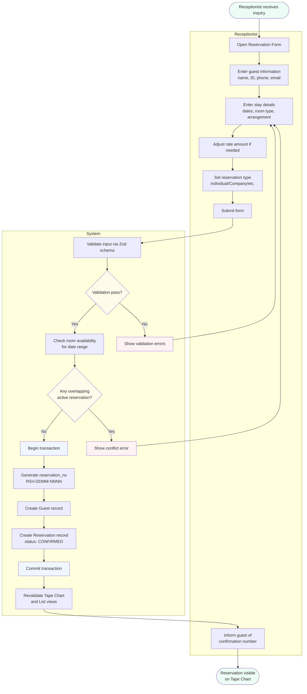
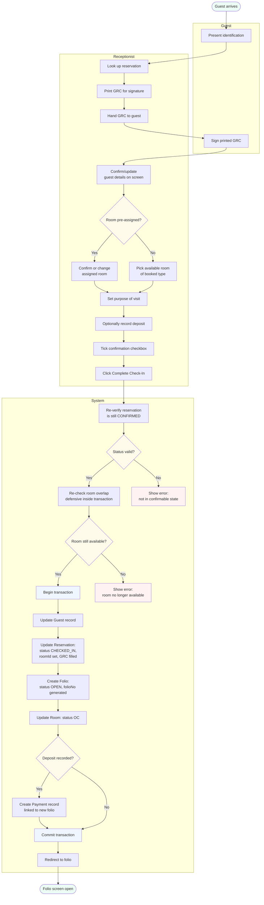
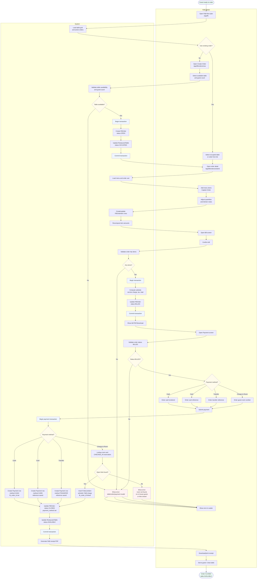
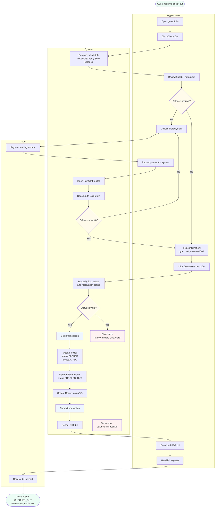
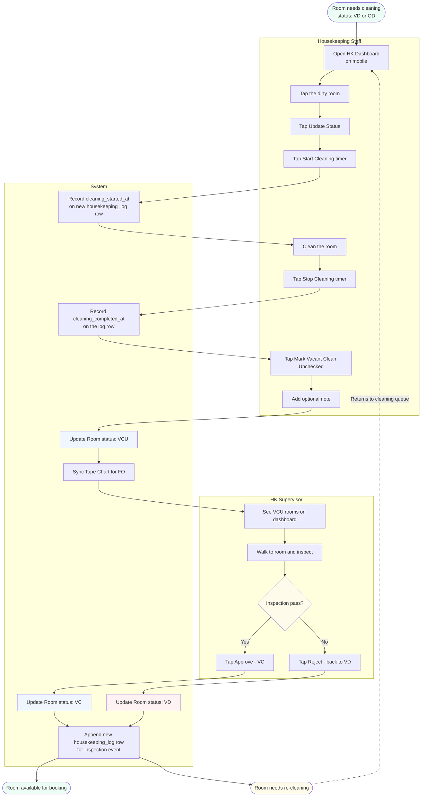
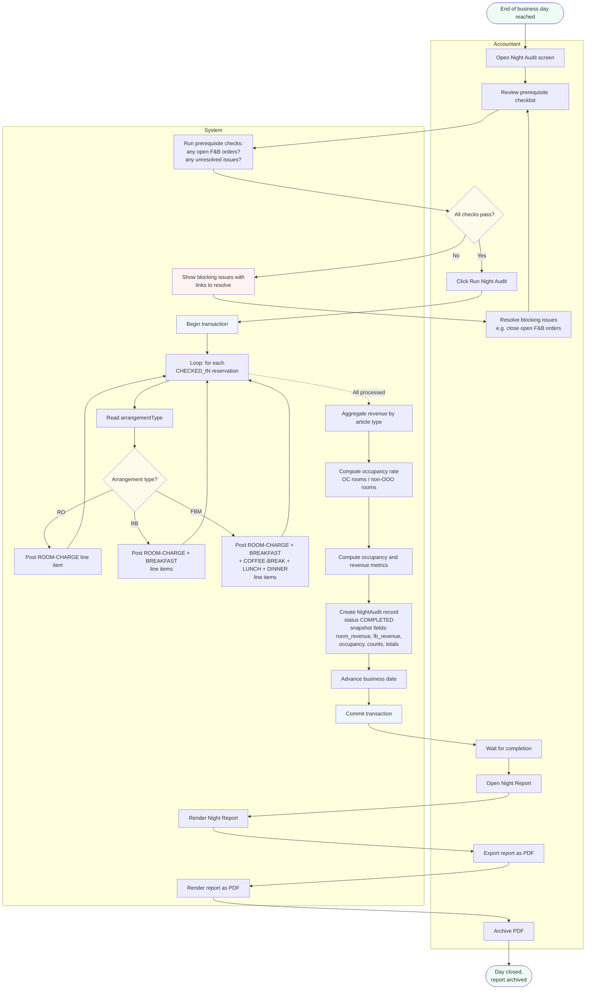

# Activity Diagrams (MVP)

UML-style activity diagrams for the main use cases. Each diagram shows the step-by-step flow of a single operation including decision points, parallel paths, and which actor (or the system) performs each step.

This document complements [use_case_narrative_mvp.md](./use_case_narrative_mvp.md) (use case overview) and [business_process_mvp.md](./business_process_mvp.md) (cross-process workflows). Where business processes are wide and shallow, activity diagrams are narrow and deep — they describe one use case at a time with full internal logic.

Diagrams use Mermaid flowchart syntax with subgraphs representing actor lanes (an approximation of UML swim lanes). View inline on GitHub or paste into [mermaid.live](https://mermaid.live).

---

## 1. Process Reservation (Create)

**Use case:** UC-FO-01 Kelola Reservasi (Create)
**Actors:** Front Office staff (Receptionist), System
**Trigger:** Guest inquiry, walk-in, or Tape Chart empty-cell click

**Key logic:**

- **Two validation gates:** Zod (form-level: required fields, formats) and overlap check (data-level: business rule). Both must pass before transaction begins.
- **Atomic creation:** Guest and Reservation are created in a single Prisma transaction. Reservation cannot exist without an associated Guest, so partial writes are prevented at the DB level.
- **Reservation number generation:** the `RSV-DDMM-NNNN` format uses today's date plus a sequential counter for the day. Counter is computed inside the transaction to prevent race conditions if two reservations are created simultaneously.

---

## 2. Process Check-in

**Use case:** UC-FO-02 Proses Check-in
**Actors:** Front Office staff (Receptionist), Guest, System
**Trigger:** Guest arrives at the hotel on or after the reservation's arrival date
**Precondition:** Reservation status is CONFIRMED, arrival date ≤ today

**Key logic:**

- **GRC printed before check-in completion:** the receptionist prints the GRC first so the guest can physically sign. The form is then completed in the system based on what the guest filled in by hand.
- **Defensive re-verification:** the system re-checks status and room availability inside the transaction. The window between form-open and form-submit could let another receptionist book the same room, so the final check happens during commit.
- **Conditional payment creation:** the transaction creates a Payment record only if `depositAmount > 0`. The optional deposit doesn't fork the transaction structurally — it adds one more operation inside the same atomic block.
- **Four state changes in one commit:** Guest update, Reservation update, Folio creation, Room update (and optional Payment) all succeed together or roll back together. This is the strongest data integrity guarantee in the system.

---

## 3. Process F&B Order

**Use case:** UC-FB-01 Create Captain Order, UC-FB-02 Process F&B Bill, UC-FB-03 Proses Pembayaran F&B
**Actors:** F&B staff (Waiter), System
**Trigger:** Guest sits at a restaurant table or waiter opens a new order
**Precondition:** Table is AVAILABLE or an existing OPEN order is selected

**Key logic:**

- **Route coverage:** the shipped flow moves through `/app/fb`, `/app/fb/orders/new`, `/app/fb/orders/[orderId]`, `/app/fb/orders/[orderId]/bill`, and `/app/fb/orders/[orderId]/payment`.
- **Table locking at order creation:** the system validates the selected table and creates the OPEN FBOrder in one transaction, then marks the RestaurantTable OCCUPIED. This prevents two waiters from opening competing orders on the same table.
- **Captain Order before billing:** menu items are stored as FBOrderItem rows while the order is OPEN. The bill cannot be generated until at least one item exists.
- **Bill locks totals:** confirming the bill computes subtotal, service charge, tax, and total from hotel settings, then changes the order from OPEN to BILLED. Payment is only allowed from BILLED state.
- **Four payment paths:** cash, card, and transfer create Payment rows linked to the FBOrder. Charge-to-room validates an in-house guest and OPEN folio, then creates a FolioLineItem with `fb_order_id` linked to the originating order.
- **Close and free table:** successful payment updates FBOrder to CLOSED and frees the RestaurantTable back to AVAILABLE. Receipt PDF generation happens after the transactional state change.

---

## 4. Process Check-out (with «include» Verify Zero-Balance)

**Use case:** UC-FO-04 Proses Check-out with «include» Verifikasi Zero-Balance
**Actors:** Front Office staff (Receptionist), Guest, System
**Trigger:** Guest is ready to leave, or departure date is reached
**Precondition:** Reservation status is CHECKED_IN, folio status is OPEN

**Key logic:**

- **«include» Verify Zero-Balance:** the verification runs whenever check-out is attempted. It's not an optional step — every check-out triggers it. The diagram shows this as the first system action after Click Check Out.
- **Payment iteration loop:** if balance is positive after first payment, the system computes again and may require another payment. This handles the case where multiple payment methods are needed (e.g., partial cash + partial card).
- **Three state changes in commit:** Folio close, Reservation flip, Room flip. The PDF generation happens AFTER commit — it's a side effect, not part of the transactional state change.
- **Acceptable credit balance:** if balance is negative (overpayment), check-out proceeds without further payment. The credit is recorded as a known accounting state — it doesn't block the guest leaving.

---

## 5. Update Room Status

**Use case:** UC-HK-02 Update Status Kamar with VCU inspection workflow
**Actors:** Housekeeping staff, Housekeeping supervisor (same person in MVP, future role), System
**Trigger:** HK staff finishes cleaning a room, OR receives notification that room needs cleaning
**Note:** The VCU intermediate state described here is a forward-looking design. MVP shipping initially uses VD → VC directly; VCU inspection is added in a subsequent HK module update.

**Key logic:**

- **Timer pair:** `cleaning_started_at` and `cleaning_completed_at` are stored on the same housekeeping_log row. Duration is derived (end - start), not stored separately. This allows for "in-progress" detection: rows with non-null start and null end mean cleaning is currently happening.
- **Single role enforcement in MVP:** the HK staff and HK supervisor are the same user role in MVP (any HK user can clean and inspect). In a future revision with proper role hierarchy, the inspect action would be gated to a supervisor sub-role.
- **Loop on rejection:** if inspection fails, the room returns to VD. The cleaning cycle repeats — same staff or different, depending on shift. The housekeeping_log row history captures every iteration for accountability.
- **Tape Chart sync:** every status change triggers Tape Chart re-render. The FO receptionist sees room status updates in near-real-time without manual refresh.

---

## 6. Run Night Audit

**Use case:** UC-AC-01 Jalankan Night Audit
**Actors:** Accounting staff (Night Auditor), System
**Trigger:** End of business day (per hotel_settings.night_audit_time, typically 23:00)
**Precondition:** All F&B orders for the day are closed, no pending operations
**Note:** This diagram represents the target workflow. Business-date advancement, cutoff enforcement, open-order blocking, and audit states beyond COMPLETED are in progress; arrangement-driven posting, snapshot capture, and duplicate-audit block are the currently-working parts.

**Key logic:**

- **Atomic across all in-house guests:** every CHECKED_IN reservation's auto-posting happens in one transaction. If posting fails for any guest midway, the entire night audit rolls back. This prevents partial-audit states where some guests were charged and others weren't.
- **Arrangement-driven posting:** the system reads each reservation's `arrangementType` and posts the corresponding articles. The article prices come from each article's `defaultPrice`. The room rate comes from the reservation's `rateAmount` (snapshot at booking).
- **Idempotency consideration:** running night audit twice for the same business date would post duplicate charges. The system prevents this by checking the NightAudit record before running — if today's business date already has a COMPLETED audit, the operation is rejected. (Implementation detail handled in AC-02.)
- **Report snapshot:** the NightAudit record stores explicit snapshot fields (`room_revenue`, `fb_revenue`, occupancy, counts, totals). This freezes the report at the moment of audit completion. Even if reservations are later edited or folios modified, the night report shows the state as it was at audit time. This is important for accounting compliance.

---

## Diagram conventions

Mermaid flowchart syntax with the following conventions:

- **Pill shapes** `([ ])` = start and end events of the use case
- **Rectangles** `[ ]` = activities performed by actors or the system
- **Diamonds** `{ }` = decision points with branching outcomes
- **Subgraphs** = actor lanes (an approximation of UML swim lanes; mermaid doesn't have native swim-lane primitives)
- **Solid arrows** = next-step transitions
- **Dotted arrows** = loop-back transitions or asynchronous returns
- **Color coding:**
  - Green `#ecfdf5` — start states and successful end states
  - Yellow `#fffbeb` — decision points or attention-required states
  - Blue `#eff6ff` — system transactional actions (begin/commit)
  - Red `#fef2f2` — error states or terminal failures

Colors match the project's status palette used throughout the application UI for visual consistency.

---

## Coverage notes

This document covers the use cases with non-trivial decision logic or multi-actor coordination. Trivial use cases are intentionally omitted from activity diagrams:

| Use Case | Reason for omission |
|---|---|
| UC-HK-01 View Room Status | Read-only display; no decision logic |
| UC-AC-02 Generate Night Report | Read-only render of NightAudit snapshot fields |
| UC-AD-01 Manage Master Data | CRUD operations; covered by use case narrative |
| UC-AD-02 Manage Users & Roles | CRUD operations; covered by use case narrative |

The six diagrams above capture the operationally-interesting flows. Read in sequence with the business process document for a complete picture of how the system behaves.
