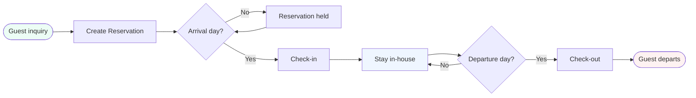
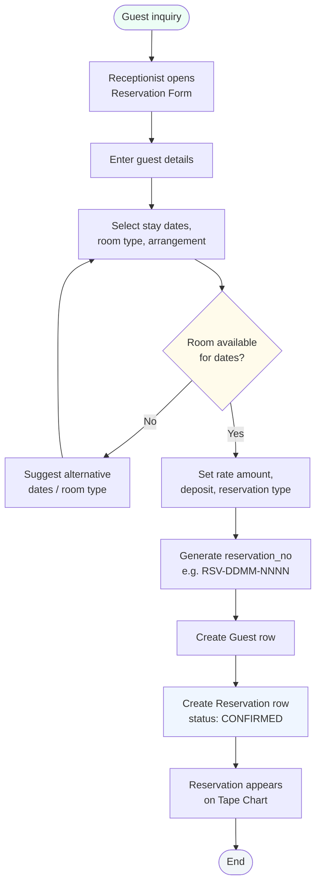
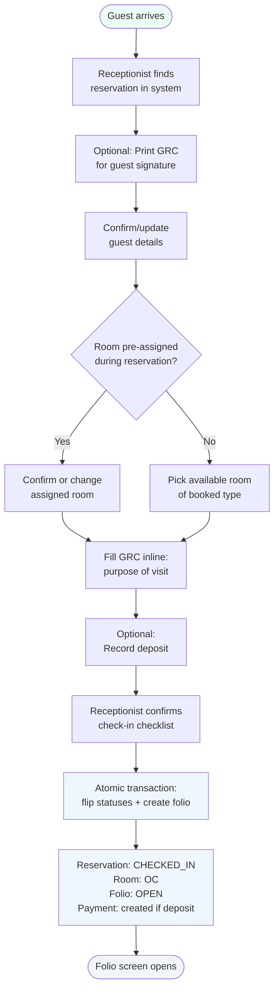
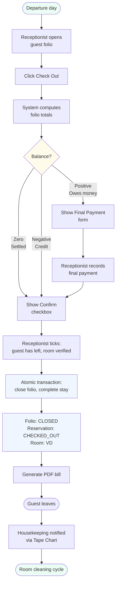
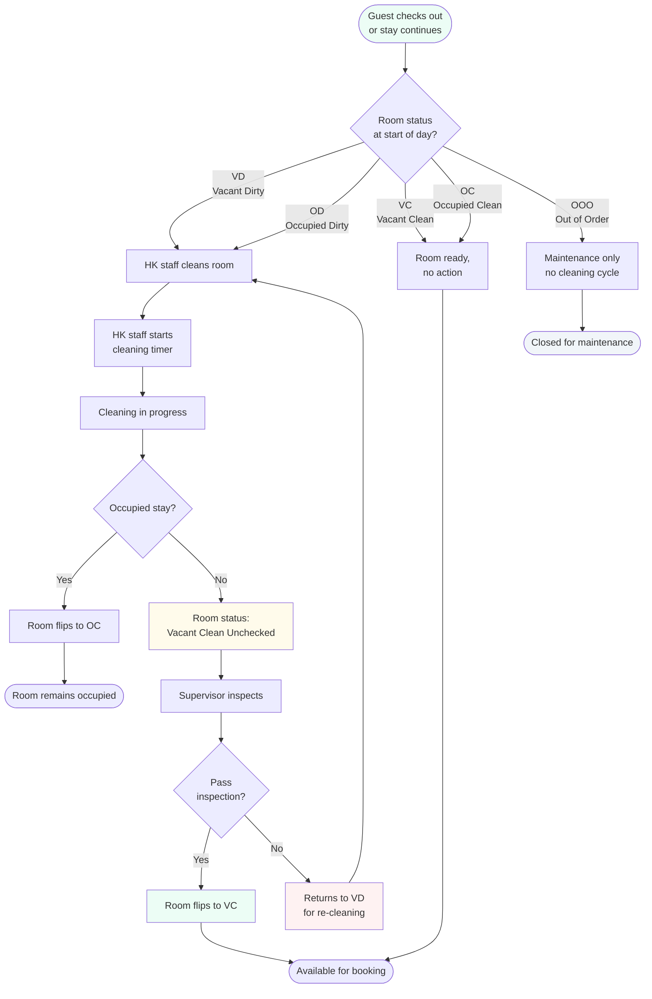
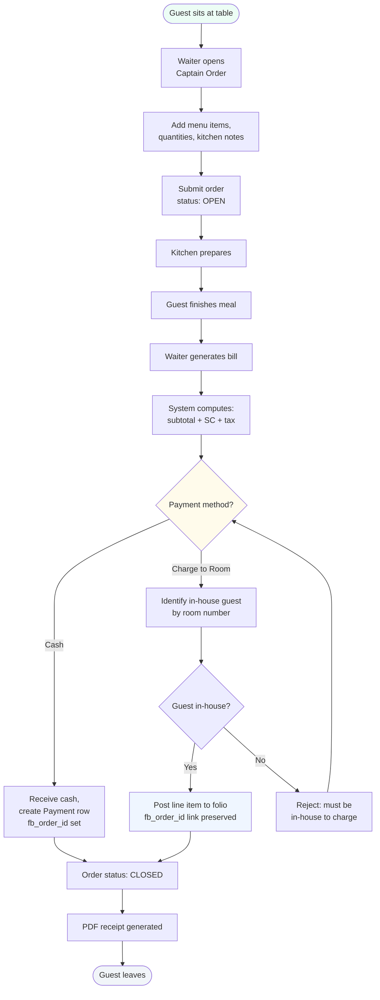
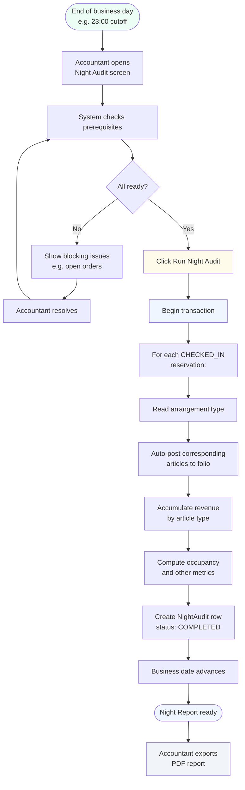
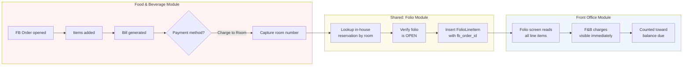

# Business Processes (MVP)

End-to-end business processes that the Hotel PMS supports. Each diagram is rendered with Mermaid — view inline on GitHub or paste into [mermaid.live](https://mermaid.live).

This document complements [use_case_narrative_mvp.md](./use_case_narrative_mvp.md) (what actors do) and [feature_list_mvp.md](./feature_list_mvp.md) (what the system implements). Where the use case narrative answers *who does what*, this document answers *in what order, with what decisions, across which modules*.

---

## 1. Guest Lifecycle (Main Process)

The spine of the entire system. Every guest moves through this sequence; every other process either feeds into or branches from it.

The process spans days. Reservation can be created days, weeks, or months before arrival. Stay duration is the planned departure minus arrival date. Check-out happens on the departure date or earlier (early check-out).

---

## 2. Reservation Process

How a new reservation enters the system. Initiated by Front Office staff.

**Decision point:** room availability check is the gating condition. The system prevents double-booking by checking active reservations (CONFIRMED or CHECKED_IN) overlapping the requested date range.

**Atomic transaction:** Guest + Reservation creation happens in a single Prisma transaction. If reservation_no generation conflicts (race condition), the transaction rolls back and a new number is generated.

---

## 3. Check-in Process

How a CONFIRMED reservation becomes a CHECKED_IN active stay. Creates the folio that will accumulate charges throughout the stay.

**Why atomic:** the four state changes must succeed together or roll back together. A reservation that's CHECKED_IN without a folio is data corruption; a room that's OC without a guest assigned is data corruption.

**Defensive overlap re-check:** even though availability was checked when the form opened, it re-checks inside the transaction. The window between form-open and form-submit could allow another receptionist to book the same room. The transaction's overlap check catches this.

---

## 4. Stay Process

What happens during the guest's in-house period. Charges accumulate, housekeeping cycles run, F&B orders flow into the folio.

**Three sources of folio line items:** night audit (room), F&B (charge-to-room), and Front Office (manual charges). All three append rows to the same `folio_line_item` table — the folio's running balance reflects all of them together.

**Arrangement-driven auto-posting:** during night audit, the system reads each in-house reservation's `arrangementType` and posts the corresponding articles:
- RO → ROOM-CHARGE only
- RB → ROOM-CHARGE + BREAKFAST
- FBM → ROOM-CHARGE + BREAKFAST + COFFEE-BREAK + LUNCH + DINNER

The receptionist doesn't manually trigger any of this; it happens automatically each business day.

---

## 5. Check-out Process

How a CHECKED_IN stay becomes a CHECKED_OUT historical record. Includes the zero-balance verification that prevents guests from leaving with unpaid bills.

**Zero-balance gate:** the Confirm Check-Out button is disabled until the balance is zero or credit. Receptionist cannot finalize check-out with money still owed — the system enforces this constraint, not policy.

**Why credit is acceptable:** if the guest overpaid (rare but happens with deposit + low actual usage), the credit is recorded but doesn't block check-out. A small overpayment isn't worth holding the guest at the desk; the credit becomes a known accounting item resolved later.

**MVP simplification:** room charges are posted by Night Audit, not by Check-out. If a guest checks out before Night Audit has posted the room charge, the folio can show a credit balance from the deposit. The Check-out screen labels that state as a refund due and allows checkout; it does not post room charges itself.

---

## 6. Housekeeping Process

Room cleaning lifecycle. Operates independently from FO transactions but feeds room status back to the Tape Chart.

**Mobile-first:** HK staff operates from phones or tablets while walking the corridors. Every status update syncs immediately to the FO Tape Chart so receptionists see the live picture.

**Inspection step:** for vacant rooms, the VCU intermediate state separates "I cleaned this" from "I verified this is ready." Occupied rooms return from OD to OC after mid-stay cleaning because they remain assigned to the in-house guest.

**Audit trail:** every status change creates a `housekeeping_log` row capturing who, when, and the from→to transition. Useful for accountability and turnover analysis.

---

## 7. Food & Beverage Process

Point-of-sale flow for the hotel restaurant. The order can be paid directly or charged to a guest's folio.

**Cross-module integration:** Charge-to-Room is the most important non-FO touchpoint. F&B writes a line item directly into a guest's folio, and the folio's running balance immediately reflects it. The receptionist at check-out sees F&B charges aggregated with all other charges — no manual reconciliation needed.

**Polymorphic Payment:** the `payment` table records both folio payments and F&B-direct payments. Exactly one of `folio_id` or `fb_order_id` is set per row; this is enforced at the database level.

---

## 8. Daily Close / Night Audit Process

End-of-business-day procedure run by Accounting. Locks the day's transactions, posts room charges, and generates the consolidated report.

**Atomic across all in-house guests:** if night audit fails midway, the whole transaction rolls back. Half-audited days are worse than no audit at all.

**The "business date" concept:** real hotels operate on a business date that differs from the calendar date for a few hours each night. A check-in at 02:00 might still belong to yesterday's business date if night audit hasn't run yet. For MVP simplicity, we treat business date as the current calendar date — but the architecture supports the proper concept if needed later.

---

## 9. Cross-Module Integration: Charge-to-Room

Detailed view of how F&B and Front Office data converge through the folio. This is the single most important integration seam in the system.

**Why this matters:** without this integration, the receptionist at check-out would need to manually reconcile every F&B receipt against the guest's stay. With it, the F&B charge appears on the folio the moment it's posted — and the running balance updates automatically.

**The link preserved:** the FolioLineItem stores `fb_order_id`, creating a trace back to the originating F&B order. If a guest disputes a charge, the receptionist can navigate from the folio line directly to the F&B order detail and resolve the question without leaving the system.

---

## Notes on diagram conventions

- **Pill shapes** `([ ])` = start/end events
- **Rectangles** `[ ]` = activities or system actions
- **Diamonds** `{ }` = decision points with branching outcomes
- **Color coding:**
  - Green `#ecfdf5` — start states, success outcomes
  - Yellow `#fffbeb` — decision points or attention-needed states
  - Blue `#eff6ff` — system actions or active in-house states
  - Red `#fef2f2` — error states or terminal failures
  - Gray `#f1f5f9` — passive / waiting / closed states

These match the project's status color palette used throughout the UI, keeping the diagrams visually consistent with the application itself.
