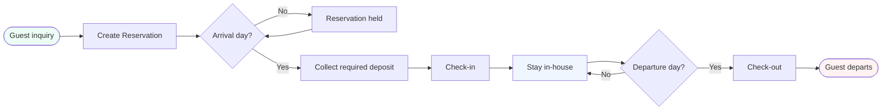
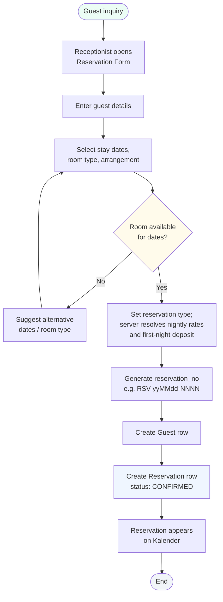
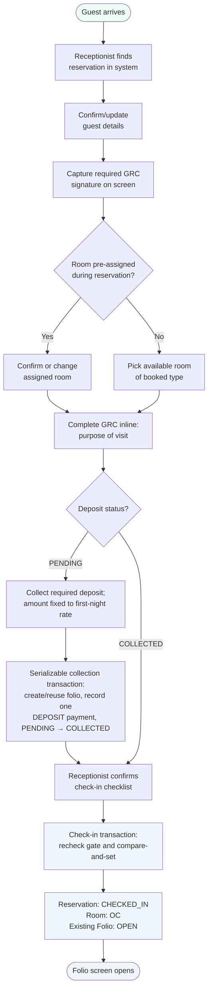
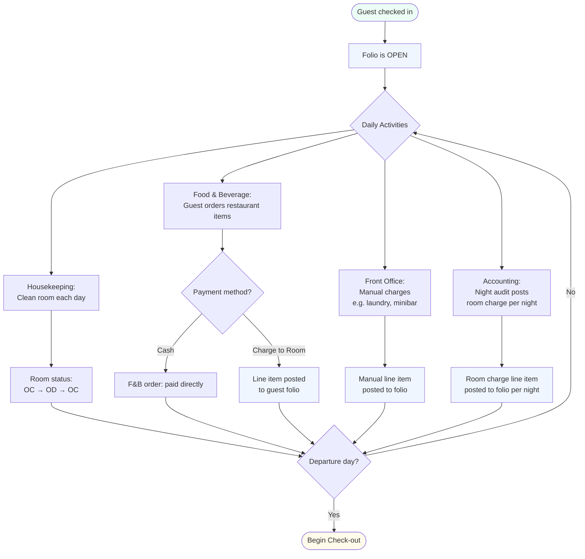
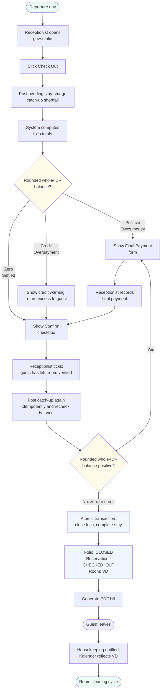
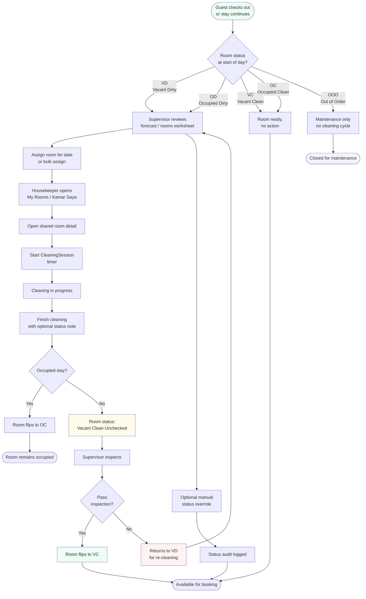
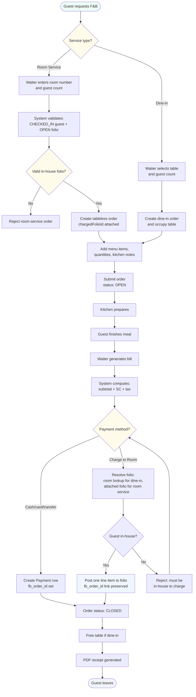
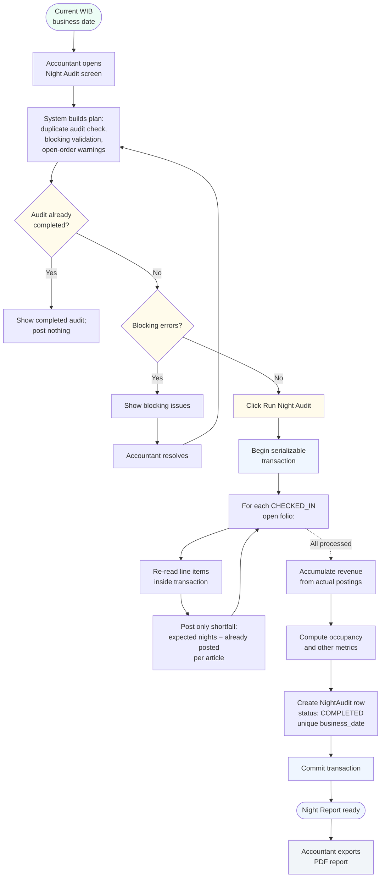
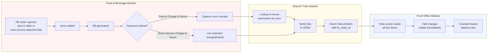

# Business Processes (MVP)

End-to-end business processes that ZADD Hotel Management supports. Each diagram is rendered with Mermaid — view inline on GitHub or paste into [mermaid.live](https://mermaid.live).

This document complements [use_case_narrative_mvp.md](./use_case_narrative_mvp.md) (what actors do) and [feature_list_mvp.md](./feature_list_mvp.md) (what the system implements). Where the use case narrative answers *who does what*, this document answers *in what order, with what decisions, across which modules*.

---

## 1. Guest Lifecycle (Main Process)

The spine of the entire system. Every guest moves through this sequence; every other process either feeds into or branches from it.

The process spans days. Reservation can be created days, weeks, or months before arrival. Stay duration is the planned departure minus arrival date. Check-out happens on the departure date or earlier (early check-out).

---

## 2. Reservation Process

How a new reservation enters the system. Initiated by Front Office staff.

**Decision point:** room-type inventory availability is the gating condition. The system prevents overbooking by counting overlapping active reservations (`CONFIRMED` or `CHECKED_IN`), including unallocated reservations, against the number of registered physical rooms for the selected type. Physical-room allocation remains optional until check-in.

**Atomic transaction:** Guest + Reservation creation happens in a single Prisma transaction. If reservation_no generation conflicts (race condition), the transaction rolls back and a new number is generated.

---

## 3. Check-in Process

How a CONFIRMED reservation with a collected deposit becomes a CHECKED_IN active stay. The folio and deposit payment are created during required deposit collection before check-in.

**Why atomic:** collection and check-in have separate atomic responsibilities. The canonical serializable collection transaction creates or reuses the folio, records one matching `DEPOSIT`-purpose payment, and compare-and-sets `PENDING → COLLECTED`; retries return the existing payment without a duplicate. The check-in transaction then rechecks `CONFIRMED`, `COLLECTED`, the existing folio and matching deposit payment, and room availability before compare-and-setting `CONFIRMED → CHECKED_IN` and updating the room. This prevents a CHECKED_IN reservation without its required folio/payment state and prevents an OC room without an assigned guest.

**Defensive overlap re-check:** even though availability was checked when the form opened, it re-checks inside the transaction. The window between form-open and form-submit could allow another receptionist to book the same room. The transaction's overlap check catches this.

**Required deposit gate:** every reservation's deposit is set by the server to its first `ReservationNight.rateAmount` and is not client-editable. On or after arrival, Front Office must collect it before check-in. `PENDING` blocks check-in with no waiver or override. Group bulk collection invokes the same writer independently for each eligible sibling; group batch check-in never collects deposits, skips `PENDING` siblings, and processes only eligible `COLLECTED` siblings.

**Digital GRC signature:** the guest signs on screen before completion. `signatureDataUrl` and `signedAt` are saved transactionally with check-in and the signature is embedded in the downloadable GRC PDF.

---

## 4. Stay Process

What happens during the guest's in-house period. Charges accumulate, housekeeping cycles run, F&B orders flow into the folio.

**Three sources of folio line items:** night audit (room), F&B (charge-to-room), and Front Office (manual charges). All three append rows to the same `folio_line_item` table — the folio's running balance reflects all of them together.

**Arrangement-driven auto-posting:** during night audit, the system reads each in-house reservation's `arrangementType` and posts the corresponding articles:
- RO → ROOM-CHARGE only
- RB → ROOM-CHARGE + BREAKFAST
- FBM → ROOM-CHARGE + BREAKFAST + COFFEE-BREAK + LUNCH + DINNER

The receptionist doesn't manually trigger any of this; it happens automatically each business day.

---

## 5. Check-out Process

How a CHECKED_IN stay becomes a CHECKED_OUT historical record. Includes a rounded whole-IDR balance gate: a positive balance blocks check-out, while a zero or credit balance may proceed.

**Stay-charge catch-up before the gate:** when check-out or final payment is attempted, the server posts any pending room/arrangement stay-charge shortfall the night audit has not posted yet, then recomputes the folio. The shortfall poster is shared with Night Audit and is idempotent, so already-posted nights are not duplicated.

**Rounded whole-IDR balance gate:** the Confirm Check-Out action is unavailable while the rounded whole-IDR balance is positive. A zero or credit balance may proceed. For a credit balance, the system shows a warning instructing the receptionist to return the excess to the guest. The server posts catch-up charges idempotently and rechecks the balance before closing the folio; a positive balance blocks check-out and leaves newly posted charges visible for settlement through the existing payment flow. There is no auto-pay or automated refund posting.

**Whole-folio balance:** the balance covers all folio line items and payments: room/arrangement charges, F&B charged to room, manual or miscellaneous charges, service/tax calculation, and recorded payments.

**Credit balance handling:** if the rounded whole-IDR balance is negative, check-out may proceed without another payment. The system displays a credit warning and instructs the receptionist to return the excess to the guest before completing check-out. The warning is operational guidance; the MVP does not post a separate automated refund transaction.

---

## 6. Housekeeping Process

Role-aware room cleaning lifecycle. FO can create dirty-room demand, supervisors plan and inspect, housekeepers clean from their assigned worklist, and every room-status change feeds back to Kalender.

**Mobile-first staff flow:** HK staff operates from phones or tablets through `/app/hk/clean` and `/app/hk/rooms/[id]` while walking the corridors. Every status update syncs immediately to FO Kalender so receptionists see the live picture.

**Supervisor flow:** `/app/hk/supervisor` gives the supervisor workload forecast, bulk assignment, VCU awaiting-inspection inbox, and live-status KPIs. `/app/hk/rooms` is the canonical daily worksheet and merged status board with inline status override, reservation context, assigned housekeeper, notes, date navigation, and Daily List print. `/app/hk/list` remains only as a temporary compatibility redirect and may be retired; operational links should use `/app/hk/rooms`.

**Inspection step:** for vacant rooms, the VCU intermediate state separates "I cleaned this" from "I verified this is ready." Occupied rooms return from OD to OC after mid-stay cleaning because they remain assigned to the in-house guest.

**Cleaning model:** `CleaningSession` is the single source for the assign → clean with timer → finish → inspect lifecycle. `HousekeepingLog` is the status-change audit capturing who, when, old status, new status, and optional status note.

**Reservation note:** `Reservation.notes` is the one reservation comment field. Front Office edits it; Housekeeping reads it as guest instruction/context on lists, cards, and room detail.

**Lost & Found:** both HK and FO can log and search text-only found items and mark an item returned with a resolution note; HK can also start from room detail. Other roles are denied. This custody flow is independent from room status and folios.

---

## 7. Food & Beverage Process

Point-of-sale flow for the hotel restaurant and in-house room service. Dine-in orders occupy a restaurant table; room-service orders are tableless and attach to the guest's open folio at creation.

**Room-service creation:** `/app/fb/orders/new?service=room-service` asks for a room number and guest count, validates that the room has a CHECKED_IN reservation with an OPEN folio, and creates an OPEN `ROOM_SERVICE` order with no table and `chargedFolioId` attached. A room with no in-house guest is rejected before the order opens.

**Shared order/bill/payment flow:** after creation, dine-in and room-service orders use the same menu, bill, payment, and receipt screens. The floor plan stays table-only; room-service orders appear in the order list/detail as `Room Service · Kamar X · Guest Y` and do not occupy or free restaurant tables.

**Cross-module integration:** Charge-to-Room is the most important non-FO touchpoint. F&B writes one line item directly into a guest's folio, and the folio's running balance immediately reflects it. For room service, the payment screen defaults to the attached folio; cash, card, and transfer remain available. The receptionist at check-out sees F&B charges aggregated with all other charges — no manual reconciliation needed.

**Polymorphic Payment:** the `payment` table records both folio payments and F&B-direct payments. Exactly one of `folio_id` or `fb_order_id` is set per row; this is enforced at the database level.

---

## 8. Daily Close / Night Audit Process

Daily-close procedure run by Accounting for the current WIB (`Asia/Jakarta`) hotel date. It posts stay-charge shortfalls, stores a one-per-business-date snapshot, and generates the consolidated report.

**WIB business date and unique lock:** the audit business date is the current hotel date in `Asia/Jakarta`, not the server-local calendar date. `night_audit.business_date` is unique; re-running the same business date is blocked and posts nothing. The app does not persist or advance a separate business-date pointer.

**Atomic shortfall posting:** if night audit fails midway, the whole transaction rolls back. Inside the serializable transaction, the system re-reads each open folio's line items and posts only the per-article shortfall between expected nights and already-posted stay charges. A missed prior night is therefore backfilled by the next run; a folio already caught up by checkout receives no duplicate lines.

**Open F&B order warnings:** open F&B orders are surfaced as warnings for the accountant to review, but they do not block the audit from running.

---

## 9. Cross-Module Integration: Charge-to-Room

Detailed view of how F&B and Front Office data converge through the folio. This is the single most important integration seam in the system.

**Why this matters:** without this integration, the receptionist at check-out would need to manually reconcile every F&B receipt against the guest's stay. With it, the F&B charge appears on the folio the moment it's posted — and the running balance updates automatically.

**The link preserved:** the FolioLineItem stores `fb_order_id`, creating a trace back to the originating F&B order. Charge-to-room creates one linked folio line for the paid order total. If a guest disputes a charge, the receptionist can navigate from the folio line directly to the F&B order detail and resolve the question without leaving the system.

**Revenue counting:** Night Audit counts closed F&B orders as F&B revenue and excludes folio line items with `fb_order_id` from other folio revenue, so charge-to-room F&B is not double-counted.

---

## Notes on diagram conventions

- **Pill shapes** `([ ])` = start/end events
- **Rectangles** `[ ]` = activities or system actions
- **Diamonds** `{ }` = decision points with branching outcomes
- **Color coding:**
  - Green `#ecfdf5` — start states, success outcomes
  - Yellow `#fffbeb` — decision points or attention-needed states
  - Blue `#eff6ff` — system actions or active in-house states
  - Red `#fef2f2` — error states or terminal failures
  - Gray `#f1f5f9` — passive / waiting / closed states

These match the project's status color palette used throughout the UI, keeping the diagrams visually consistent with the application itself.
