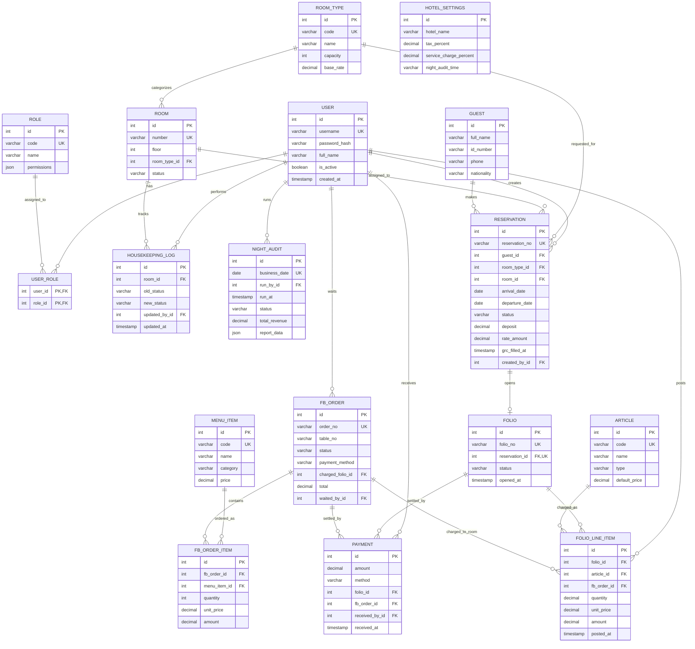

# 3.2.4 Perancangan Basis Data (MVP)

Subbab ini menjelaskan perancangan basis data Sistem Manajemen Properti Hotel untuk lingkup MVP (*Minimum Viable Product*). Basis data dirancang untuk diimplementasikan menggunakan PostgreSQL dengan ORM Prisma. Total tujuh belas tabel diorganisasi ke dalam lima domain logis: autentikasi, master data, front office, food & beverage, housekeeping, akuntansi, dan pembayaran.

## 3.2.4.1 Entity Relationship Diagram

ERD pada Gambar 3.2 menggambarkan tujuh belas entitas beserta relasi antar entitas menggunakan notasi *crow's foot*.

> **Catatan render**: Source mermaid di atas dapat dirender melalui [mermaid.live](https://mermaid.live) lalu diekspor ke PNG/SVG untuk disisipkan sebagai Gambar 3.2.

---

## 3.2.4.2 Skema Relasi

Notasi relasi berikut menggunakan format `NamaTabel(*pk*, **fk_name**, atribut1, atribut2, ...)`. Atribut bertanda **\*** merupakan primary key, atribut bertanda **\#** merupakan foreign key.

**Domain Autentikasi**

1. User(*id*, username, email, password_hash, full_name, is_active, created_at, updated_at)
2. Role(*id*, code, name, permissions)
3. UserRole(*user_id\#*, *role_id\#*, assigned_at)

**Domain Master Data**

4. RoomType(*id*, code, name, description, capacity, base_rate)
5. Room(*id*, number, floor, *room_type_id\#*, status)
6. Article(*id*, code, name, type, default_price)
7. HotelSettings(*id*, hotel_name, address, tax_percent, service_charge_percent, night_audit_time, currency)

**Domain Front Office**

8. Guest(*id*, full_name, id_number, phone, email, address, nationality)
9. Reservation(*id*, reservation_no, *guest_id\#*, *room_type_id\#*, *room_id\#*, *created_by_id\#*, arrival_date, departure_date, adults, children, status, deposit, rate_amount, notes, grc_filled_at, grc_purpose_of_visit, created_at, updated_at)
10. Folio(*id*, folio_no, *reservation_id\#*, status, opened_at, closed_at)
11. FolioLineItem(*id*, *folio_id\#*, *article_id\#*, *fb_order_id\#*, *posted_by_id\#*, description, quantity, unit_price, amount, posted_at)

**Domain Food & Beverage**

12. MenuItem(*id*, code, name, category, price, is_active)
13. FBOrder(*id*, order_no, *charged_folio_id\#*, *waited_by_id\#*, table_no, status, payment_method, subtotal, service_charge, tax, total, opened_at, closed_at)
14. FBOrderItem(*id*, *fb_order_id\#*, *menu_item_id\#*, quantity, unit_price, amount, notes)

**Domain Housekeeping**

15. HousekeepingLog(*id*, *room_id\#*, *updated_by_id\#*, old_status, new_status, note, updated_at)

**Domain Akuntansi**

16. NightAudit(*id*, business_date, *run_by_id\#*, run_at, status, total_revenue, occupancy_rate, report_data)

**Domain Pembayaran**

17. Payment(*id*, *folio_id\#*, *fb_order_id\#*, *received_by_id\#*, amount, method, reference, received_at)

---

## 3.2.4.3 Keputusan Perancangan

Beberapa keputusan perancangan yang perlu dijelaskan:

1. **Rate disematkan pada RoomType.** Dalam versi MVP, satu tipe kamar memiliki satu tarif tetap (`base_rate`). Perancangan rate plan dinamis dengan validitas tanggal dan segment tamu diajukan untuk pengembangan selanjutnya.
2. **Guest Registration Card (GRC) disematkan pada Reservation.** Field `grc_filled_at` dan `grc_purpose_of_visit` ditempatkan langsung pada tabel Reservation karena relasinya adalah *one-to-one-at-most* dan pengisiannya terjadi pada saat check-in.
3. **Snapshot rate pada Reservation.** Kolom `rate_amount` pada Reservation menyimpan tarif yang berlaku saat reservasi dibuat, sehingga perubahan `base_rate` di kemudian hari tidak mempengaruhi reservasi yang sudah ada.
4. **Payment bersifat polimorfik.** Tepat satu dari `folio_id` atau `fb_order_id` harus terisi pada setiap baris Payment. Constraint ini diimplementasikan sebagai CHECK constraint pada level basis data atau divalidasi pada layer aplikasi.
5. **Room.status terdenormalisasi.** Status kamar terkini disimpan langsung pada tabel Room untuk mempercepat *read* pada Tape Chart, sementara HousekeepingLog berperan sebagai jejak audit seluruh perubahan status.
6. **Folio line item mencakup charge F&B.** Ketika pembayaran F&B menggunakan metode *charge to room*, baris FolioLineItem dibuat dengan `fb_order_id` terisi, memungkinkan penelusuran antara folio dan order F&B yang menghasilkannya.

---

## 3.2.4.4 Spesifikasi Tabel

### Tabel 3.2 Spesifikasi Tabel `user`

| Atribut | Tipe Data | Constraint | Keterangan |
|---|---|---|---|
| id | SERIAL | PRIMARY KEY | Identifier unik pengguna |
| username | VARCHAR(50) | UNIQUE, NOT NULL | Username login |
| email | VARCHAR(100) | UNIQUE | Email pengguna |
| password_hash | VARCHAR(255) | NOT NULL | Hash password (bcrypt) |
| full_name | VARCHAR(100) | NOT NULL | Nama lengkap pengguna |
| is_active | BOOLEAN | NOT NULL, DEFAULT TRUE | Status aktif akun |
| created_at | TIMESTAMP | NOT NULL, DEFAULT NOW() | Waktu pembuatan akun |
| updated_at | TIMESTAMP | NOT NULL | Waktu pembaruan terakhir |

### Tabel 3.3 Spesifikasi Tabel `role`

| Atribut | Tipe Data | Constraint | Keterangan |
|---|---|---|---|
| id | SERIAL | PRIMARY KEY | Identifier unik role |
| code | VARCHAR(20) | UNIQUE, NOT NULL | Kode role (FO, HK, FB, ACC, ADMIN) |
| name | VARCHAR(50) | NOT NULL | Nama role |
| permissions | JSONB | NOT NULL | Mapping permission per modul |

### Tabel 3.4 Spesifikasi Tabel `user_role`

| Atribut | Tipe Data | Constraint | Keterangan |
|---|---|---|---|
| user_id | INT | PRIMARY KEY, FOREIGN KEY → user(id) | Referensi pengguna |
| role_id | INT | PRIMARY KEY, FOREIGN KEY → role(id) | Referensi role |
| assigned_at | TIMESTAMP | NOT NULL, DEFAULT NOW() | Waktu role di-assign |

### Tabel 3.5 Spesifikasi Tabel `room_type`

| Atribut | Tipe Data | Constraint | Keterangan |
|---|---|---|---|
| id | SERIAL | PRIMARY KEY | Identifier unik tipe kamar |
| code | VARCHAR(20) | UNIQUE, NOT NULL | Kode tipe (STD, DLX, SUP) |
| name | VARCHAR(50) | NOT NULL | Nama tipe kamar |
| description | TEXT | — | Deskripsi tipe kamar |
| capacity | INT | NOT NULL | Kapasitas tamu maksimal |
| base_rate | DECIMAL(12,2) | NOT NULL | Tarif dasar per malam |

### Tabel 3.6 Spesifikasi Tabel `room`

| Atribut | Tipe Data | Constraint | Keterangan |
|---|---|---|---|
| id | SERIAL | PRIMARY KEY | Identifier unik kamar |
| number | VARCHAR(10) | UNIQUE, NOT NULL | Nomor kamar |
| floor | INT | NOT NULL | Lantai kamar |
| room_type_id | INT | FOREIGN KEY → room_type(id) | Referensi tipe kamar |
| status | VARCHAR(10) | NOT NULL, DEFAULT 'VC' | Status kamar (VC, VD, OC, OD, OOO) |

### Tabel 3.7 Spesifikasi Tabel `article`

| Atribut | Tipe Data | Constraint | Keterangan |
|---|---|---|---|
| id | SERIAL | PRIMARY KEY | Identifier unik article |
| code | VARCHAR(20) | UNIQUE, NOT NULL | Kode charge |
| name | VARCHAR(100) | NOT NULL | Nama charge |
| type | VARCHAR(20) | NOT NULL | Jenis (ROOM, FB, SERVICE, TAX, MISC) |
| default_price | DECIMAL(12,2) | — | Harga default (opsional) |

### Tabel 3.8 Spesifikasi Tabel `hotel_settings`

| Atribut | Tipe Data | Constraint | Keterangan |
|---|---|---|---|
| id | INT | PRIMARY KEY, DEFAULT 1 | Singleton (selalu satu baris) |
| hotel_name | VARCHAR(100) | NOT NULL | Nama hotel |
| address | TEXT | — | Alamat hotel |
| tax_percent | DECIMAL(5,2) | NOT NULL | Persentase pajak |
| service_charge_percent | DECIMAL(5,2) | NOT NULL | Persentase service charge |
| night_audit_time | VARCHAR(5) | NOT NULL | Waktu cut-off night audit (HH:MM) |
| currency | VARCHAR(5) | NOT NULL, DEFAULT 'IDR' | Mata uang sistem |

### Tabel 3.9 Spesifikasi Tabel `guest`

| Atribut | Tipe Data | Constraint | Keterangan |
|---|---|---|---|
| id | SERIAL | PRIMARY KEY | Identifier unik tamu |
| full_name | VARCHAR(100) | NOT NULL | Nama lengkap tamu |
| id_number | VARCHAR(50) | — | Nomor KTP/Paspor |
| phone | VARCHAR(20) | — | Nomor telepon |
| email | VARCHAR(100) | — | Email tamu |
| address | TEXT | — | Alamat tamu |
| nationality | VARCHAR(50) | — | Kewarganegaraan |

### Tabel 3.10 Spesifikasi Tabel `reservation`

| Atribut | Tipe Data | Constraint | Keterangan |
|---|---|---|---|
| id | SERIAL | PRIMARY KEY | Identifier unik reservasi |
| reservation_no | VARCHAR(20) | UNIQUE, NOT NULL | Nomor reservasi |
| guest_id | INT | FOREIGN KEY → guest(id) | Tamu pemesan |
| room_type_id | INT | FOREIGN KEY → room_type(id) | Tipe kamar yang dipesan |
| room_id | INT | FOREIGN KEY → room(id) | Kamar yang di-assign saat check-in |
| arrival_date | DATE | NOT NULL | Tanggal check-in rencana |
| departure_date | DATE | NOT NULL | Tanggal check-out rencana |
| adults | INT | NOT NULL, DEFAULT 1 | Jumlah dewasa |
| children | INT | NOT NULL, DEFAULT 0 | Jumlah anak |
| status | VARCHAR(20) | NOT NULL, DEFAULT 'CONFIRMED' | CONFIRMED, CHECKED_IN, CHECKED_OUT, CANCELLED, NO_SHOW |
| deposit | DECIMAL(12,2) | NOT NULL, DEFAULT 0 | Deposit yang dibayar |
| rate_amount | DECIMAL(12,2) | NOT NULL | Snapshot tarif saat reservasi dibuat |
| notes | TEXT | — | Catatan reservasi |
| grc_filled_at | TIMESTAMP | — | Waktu pengisian GRC |
| grc_purpose_of_visit | VARCHAR(100) | — | Tujuan kunjungan (bagian dari GRC) |
| created_by_id | INT | FOREIGN KEY → user(id) | Petugas pembuat reservasi |
| created_at | TIMESTAMP | NOT NULL, DEFAULT NOW() | Waktu pembuatan |
| updated_at | TIMESTAMP | NOT NULL | Waktu pembaruan terakhir |

### Tabel 3.11 Spesifikasi Tabel `folio`

| Atribut | Tipe Data | Constraint | Keterangan |
|---|---|---|---|
| id | SERIAL | PRIMARY KEY | Identifier unik folio |
| folio_no | VARCHAR(20) | UNIQUE, NOT NULL | Nomor folio |
| reservation_id | INT | UNIQUE, FOREIGN KEY → reservation(id) | Reservasi terkait |
| status | VARCHAR(10) | NOT NULL, DEFAULT 'OPEN' | OPEN, CLOSED, VOIDED |
| opened_at | TIMESTAMP | NOT NULL, DEFAULT NOW() | Waktu folio dibuka |
| closed_at | TIMESTAMP | — | Waktu folio ditutup |

### Tabel 3.12 Spesifikasi Tabel `folio_line_item`

| Atribut | Tipe Data | Constraint | Keterangan |
|---|---|---|---|
| id | SERIAL | PRIMARY KEY | Identifier unik line item |
| folio_id | INT | FOREIGN KEY → folio(id) | Folio yang dikenai charge |
| article_id | INT | FOREIGN KEY → article(id) | Article (charge code) |
| fb_order_id | INT | FOREIGN KEY → fb_order(id) | F&B order (jika charge to room) |
| description | VARCHAR(255) | NOT NULL | Deskripsi item |
| quantity | DECIMAL(8,2) | NOT NULL, DEFAULT 1 | Kuantitas |
| unit_price | DECIMAL(12,2) | NOT NULL | Harga satuan |
| amount | DECIMAL(12,2) | NOT NULL | Total (quantity × unit_price) |
| posted_by_id | INT | FOREIGN KEY → user(id) | Petugas yang posting |
| posted_at | TIMESTAMP | NOT NULL, DEFAULT NOW() | Waktu posting |

### Tabel 3.13 Spesifikasi Tabel `menu_item`

| Atribut | Tipe Data | Constraint | Keterangan |
|---|---|---|---|
| id | SERIAL | PRIMARY KEY | Identifier unik menu |
| code | VARCHAR(20) | UNIQUE, NOT NULL | Kode menu |
| name | VARCHAR(100) | NOT NULL | Nama menu |
| category | VARCHAR(50) | NOT NULL | Kategori (Main, Beverage, Dessert, dsb.) |
| price | DECIMAL(12,2) | NOT NULL | Harga jual |
| is_active | BOOLEAN | NOT NULL, DEFAULT TRUE | Status aktif |

### Tabel 3.14 Spesifikasi Tabel `fb_order`

| Atribut | Tipe Data | Constraint | Keterangan |
|---|---|---|---|
| id | SERIAL | PRIMARY KEY | Identifier unik order |
| order_no | VARCHAR(20) | UNIQUE, NOT NULL | Nomor order |
| table_no | VARCHAR(10) | — | Nomor meja |
| status | VARCHAR(20) | NOT NULL, DEFAULT 'OPEN' | OPEN, BILLED, CLOSED, VOIDED |
| payment_method | VARCHAR(20) | — | CASH, CHARGE_TO_ROOM (di-set saat billing) |
| charged_folio_id | INT | FOREIGN KEY → folio(id) | Folio tujuan jika charge to room |
| subtotal | DECIMAL(12,2) | NOT NULL, DEFAULT 0 | Subtotal sebelum SC dan tax |
| service_charge | DECIMAL(12,2) | NOT NULL, DEFAULT 0 | Service charge |
| tax | DECIMAL(12,2) | NOT NULL, DEFAULT 0 | Pajak |
| total | DECIMAL(12,2) | NOT NULL, DEFAULT 0 | Total bayar |
| waited_by_id | INT | FOREIGN KEY → user(id) | Waiter yang melayani |
| opened_at | TIMESTAMP | NOT NULL, DEFAULT NOW() | Waktu order dibuat |
| closed_at | TIMESTAMP | — | Waktu order ditutup |

### Tabel 3.15 Spesifikasi Tabel `fb_order_item`

| Atribut | Tipe Data | Constraint | Keterangan |
|---|---|---|---|
| id | SERIAL | PRIMARY KEY | Identifier unik item |
| fb_order_id | INT | FOREIGN KEY → fb_order(id) | Order yang berisi item |
| menu_item_id | INT | FOREIGN KEY → menu_item(id) | Menu yang dipesan |
| quantity | INT | NOT NULL | Kuantitas |
| unit_price | DECIMAL(12,2) | NOT NULL | Harga satuan saat order |
| amount | DECIMAL(12,2) | NOT NULL | Total |
| notes | VARCHAR(255) | — | Catatan dapur |

### Tabel 3.16 Spesifikasi Tabel `housekeeping_log`

| Atribut | Tipe Data | Constraint | Keterangan |
|---|---|---|---|
| id | SERIAL | PRIMARY KEY | Identifier unik log |
| room_id | INT | FOREIGN KEY → room(id) | Kamar yang di-update |
| old_status | VARCHAR(10) | NOT NULL | Status sebelum update |
| new_status | VARCHAR(10) | NOT NULL | Status setelah update |
| note | TEXT | — | Catatan petugas |
| updated_by_id | INT | FOREIGN KEY → user(id) | Petugas HK yang update |
| updated_at | TIMESTAMP | NOT NULL, DEFAULT NOW() | Waktu update |

### Tabel 3.17 Spesifikasi Tabel `night_audit`

| Atribut | Tipe Data | Constraint | Keterangan |
|---|---|---|---|
| id | SERIAL | PRIMARY KEY | Identifier unik night audit |
| business_date | DATE | UNIQUE, NOT NULL | Tanggal bisnis yang di-close |
| run_by_id | INT | FOREIGN KEY → user(id) | Night auditor |
| run_at | TIMESTAMP | NOT NULL, DEFAULT NOW() | Waktu eksekusi |
| status | VARCHAR(20) | NOT NULL | PENDING, RUNNING, COMPLETED, FAILED |
| total_revenue | DECIMAL(14,2) | — | Total revenue hari tersebut |
| occupancy_rate | DECIMAL(5,2) | — | Tingkat hunian (%) |
| report_data | JSONB | — | Snapshot data untuk night report |

### Tabel 3.18 Spesifikasi Tabel `payment`

| Atribut | Tipe Data | Constraint | Keterangan |
|---|---|---|---|
| id | SERIAL | PRIMARY KEY | Identifier unik payment |
| amount | DECIMAL(12,2) | NOT NULL | Jumlah pembayaran |
| method | VARCHAR(20) | NOT NULL | CASH, TRANSFER, CARD, CHARGE_TO_ROOM |
| reference | VARCHAR(100) | — | Nomor referensi (bank ref, card last 4) |
| folio_id | INT | FOREIGN KEY → folio(id) | Folio yang dibayar (opsional) |
| fb_order_id | INT | FOREIGN KEY → fb_order(id) | F&B order yang dibayar (opsional) |
| received_by_id | INT | FOREIGN KEY → user(id) | Petugas penerima |
| received_at | TIMESTAMP | NOT NULL, DEFAULT NOW() | Waktu pembayaran |

> **Constraint polimorfik pada Payment**: tepat satu dari `folio_id` atau `fb_order_id` harus terisi.
