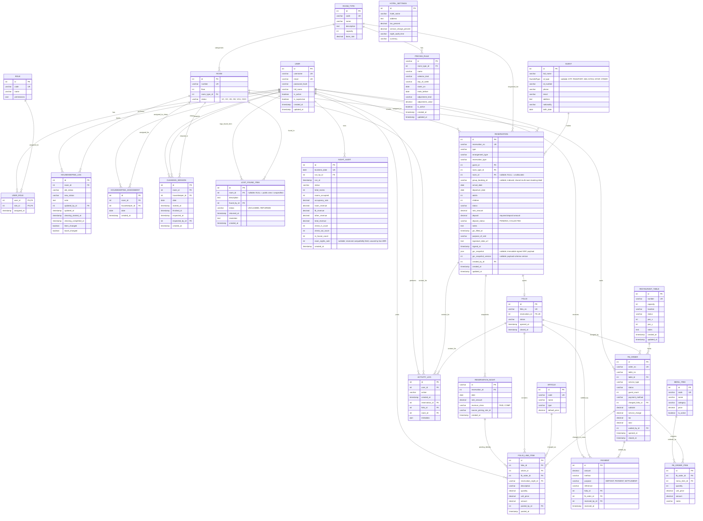

# Database Specification (MVP)

Database design for the ZADD Hotel Management MVP. Implemented in PostgreSQL with Prisma ORM. 25 tables organized across eight logical domains: authentication, master data, front office, food & beverage, housekeeping, accounting, payment, and activity logging.

The source of truth for the schema itself is `prisma/schema.prisma`. This document describes the intent, relationships, and design decisions behind it.

---

## Entity Relationship Diagram

The ERD below shows all 25 entities and their relationships in crow's-foot notation. Render through [mermaid.live](https://mermaid.live) or any Mermaid-compatible viewer.

```mermaid
erDiagram
  USER ||--o{ USER_ROLE : "has"
  ROLE ||--o{ USER_ROLE : "assigned_to"
  USER ||--o{ HOUSEKEEPING_LOG : "performs"
  USER ||--o{ HOUSEKEEPING_ASSIGNMENT : "assigned_to_clean"
  USER ||--o{ CLEANING_SESSION : "cleans"
  USER ||--o{ CLEANING_SESSION : "inspects"
  USER ||--o{ LOST_FOUND_ITEM : "logs_found_item"
  USER ||--o{ NIGHT_AUDIT : "runs"
  USER ||--o{ PAYMENT : "receives"
  USER ||--o{ RESERVATION : "creates"
  USER ||--o{ FB_ORDER : "waits"
  USER ||--o{ FOLIO_LINE_ITEM : "posts"
  USER ||--o{ ACTIVITY_LOG : "performs"

  ROOM_TYPE ||--o{ ROOM : "categorizes"
  ROOM_TYPE ||--o{ RESERVATION : "requested_for"
  ROOM_TYPE ||--o{ PRICING_RULE : "has"

  ROOM ||--o{ HOUSEKEEPING_LOG : "tracks"
  ROOM ||--o{ HOUSEKEEPING_ASSIGNMENT : "assigned_for"
  ROOM ||--o{ CLEANING_SESSION : "cleaned_in"
  ROOM ||--o{ LOST_FOUND_ITEM : "found_in"
  ROOM ||--o{ RESERVATION : "assigned_to"
  ROOM ||--o{ ACTIVITY_LOG : "context_for"

  GUEST ||--o{ RESERVATION : "makes"
  RESERVATION ||--o{ RESERVATION_NIGHT : "snapshots"
  RESERVATION ||--o| FOLIO : "opens"
  RESERVATION ||--o{ ACTIVITY_LOG : "context_for"
  RESERVATION_NIGHT ||--o{ FOLIO_LINE_ITEM : "posting_identity"
  FOLIO ||--o{ FOLIO_LINE_ITEM : "contains"
  FOLIO ||--o{ PAYMENT : "settled_by"
  FOLIO ||--o{ FB_ORDER : "charged_by"
  FOLIO ||--o{ ACTIVITY_LOG : "context_for"

  ARTICLE ||--o{ FOLIO_LINE_ITEM : "charged_as"

  MENU_ITEM ||--o{ FB_ORDER_ITEM : "ordered_as"
  RESTAURANT_TABLE ||--o{ FB_ORDER : "hosts"
  FB_ORDER ||--o{ FB_ORDER_ITEM : "contains"
  FB_ORDER ||--o{ PAYMENT : "settled_by"
  FB_ORDER ||--o{ FOLIO_LINE_ITEM : "charged_to_room"

  USER {
    int id PK
    varchar username UK
    varchar email UK
    varchar password_hash
    varchar full_name
    boolean is_active
    boolean is_supervisor
    timestamp created_at
    timestamp updated_at
  }
  ROLE {
    int id PK
    varchar code UK
    varchar name
    json permissions
  }
  USER_ROLE {
    int user_id PK, FK
    int role_id PK, FK
    timestamp assigned_at
  }
  ROOM_TYPE {
    int id PK
    varchar code UK
    varchar name
    text description
    int capacity
    decimal base_rate
  }
  PRICING_RULE {
    varchar id PK
    int room_type_id FK
    varchar name
    varchar selector_kind
    varchar day_of_week
    date starts_on
    date ends_before
    varchar adjustment_kind
    decimal adjustment_value
    boolean is_active
    timestamp created_at
    timestamp updated_at
  }
  ROOM {
    int id PK
    varchar number UK
    int floor
    int room_type_id FK
    varchar status "VC, OC, VD, OD, VCU, OOO"
  }
  ARTICLE {
    int id PK
    varchar code UK
    varchar name
    varchar type
    decimal default_price
  }
  HOTEL_SETTINGS {
    int id PK
    varchar hotel_name
    text address
    decimal tax_percent
    decimal service_charge_percent
    varchar night_audit_time
    varchar currency
  }
  GUEST {
    int id PK
    varchar full_name
    GuestIdType id_type "nullable: KTP, PASSPORT, SIM, KITAS, KITAP, OTHER"
    varchar id_number
    varchar phone
    varchar email
    text address
    varchar nationality
    date birth_date
  }
  RESERVATION {
    int id PK
    varchar reservation_no UK
    varchar type
    varchar arrangement_type
    varchar reservation_type
    int guest_id FK
    int room_type_id FK
    int room_id FK "nullable; NULL = unallocated"
    varchar group_booking_id "nullable; indexed; shared multi-room booking label"
    date arrival_date
    date departure_date
    int adults
    int children
    varchar status
    decimal rate_amount
    decimal deposit "required deposit amount"
    varchar deposit_status "PENDING, COLLECTED"
    text notes
    timestamp grc_filled_at
    varchar purpose_of_visit
    text signature_data_url
    timestamp signed_at
    json grc_snapshot "nullable; immutable signed GRC payload"
    int grc_snapshot_version "nullable; payload schema version"
    int created_by_id FK
    timestamp created_at
    timestamp updated_at
  }
  RESERVATION_NIGHT {
    varchar id PK
    int reservation_id FK
    date date
    decimal rate_amount
    varchar revenue_class "PAID, COMP"
    varchar source_pricing_rule_id
    timestamp created_at
  }
  FOLIO {
    int id PK
    varchar folio_no UK
    int reservation_id FK, UK
    varchar status
    timestamp opened_at
    timestamp closed_at
  }
  FOLIO_LINE_ITEM {
    int id PK
    int folio_id FK
    int article_id FK
    int fb_order_id FK
    varchar reservation_night_id FK
    varchar description
    decimal quantity
    decimal unit_price
    decimal amount
    int posted_by_id FK
    timestamp posted_at
  }
  MENU_ITEM {
    int id PK
    varchar code UK
    varchar name
    varchar category
    decimal price
    boolean is_active
  }
  RESTAURANT_TABLE {
    int id PK
    varchar number UK
    int capacity
    varchar location
    varchar status
    int pos_x
    int pos_y
    text notes
    timestamp created_at
    timestamp updated_at
  }
  FB_ORDER {
    int id PK
    varchar order_no UK
    varchar table_no
    int table_id FK
    varchar service_type
    varchar status
    int guest_count
    varchar payment_method
    int charged_folio_id FK
    decimal subtotal
    decimal service_charge
    decimal tax
    decimal total
    int waited_by_id FK
    timestamp opened_at
    timestamp closed_at
  }
  FB_ORDER_ITEM {
    int id PK
    int fb_order_id FK
    int menu_item_id FK
    int quantity
    decimal unit_price
    decimal amount
    varchar notes
  }
  HOUSEKEEPING_LOG {
    int id PK
    int room_id FK
    varchar old_status
    varchar new_status
    text note
    int updated_by_id FK
    timestamp updated_at
    timestamp cleaning_started_at
    timestamp cleaning_completed_at
    boolean linen_changed
    boolean towel_changed
  }
  HOUSEKEEPING_ASSIGNMENT {
    int id PK
    int room_id FK
    int housekeeper_id FK
    date date
    timestamp created_at
  }
  CLEANING_SESSION {
    int id PK
    int room_id FK
    int housekeeper_id FK
    date date
    timestamp started_at
    timestamp finished_at
    timestamp inspected_at
    int inspected_by_id FK
    timestamp created_at
  }
  LOST_FOUND_ITEM {
    int id PK
    int room_id FK "nullable; NULL = public area / unspecified"
    text description
    int found_by_id FK
    varchar status "UNCLAIMED, RETURNED"
    timestamp returned_at
    text resolution
    timestamp created_at
  }
  NIGHT_AUDIT {
    int id PK
    date business_date UK
    int run_by_id FK
    timestamp run_at
    varchar status
    int total_rooms
    int rooms_occupied
    decimal occupancy_rate
    decimal room_revenue
    decimal fb_revenue
    decimal other_revenue
    decimal total_revenue
    int check_in_count
    int check_out_count
    int in_house_count
    int room_nights_sold "nullable; reserved compatibility field; unused by live ARR"
    timestamp created_at
  }
  PAYMENT {
    int id PK
    decimal amount
    varchar method
    varchar purpose "DEPOSIT, PAYMENT, SETTLEMENT"
    varchar reference
    int folio_id FK
    int fb_order_id FK
    int received_by_id FK
    timestamp received_at
  }
  ACTIVITY_LOG {
    int id PK
    int user_id FK
    varchar action
    timestamp created_at
    int reservation_id FK
    int folio_id FK
    int room_id FK
    json metadata
  }
```

---

## Relational schema

Notation: `TableName(*pk*, *fk\#*, attr1, attr2, ...)`. Attributes marked with `*` are primary keys; those marked with `\#` are foreign keys.

**Authentication**

1. User(*id*, username, email, password_hash, full_name, is_active, is_supervisor, created_at, updated_at)
2. Role(*id*, code, name, permissions)
3. UserRole(*user_id\#*, *role_id\#*, assigned_at)

**Master data**

4. RoomType(*id*, code, name, description, capacity, base_rate)
5. PricingRule(*id*, *room_type_id\#*, name, selector_kind, day_of_week nullable, starts_on nullable, ends_before nullable, adjustment_kind, adjustment_value, is_active, created_at, updated_at)
6. Room(*id*, number, floor, *room_type_id\#*, status)
7. Article(*id*, code, name, type, default_price)
8. HotelSettings(*id*, hotel_name, address, tax_percent, service_charge_percent, night_audit_time, currency)

**Front Office**

9. Guest(*id*, full_name, id_type nullable, id_number, phone, email, address, nationality, birth_date)
10. Reservation(*id*, reservation_no, type, arrangement_type, reservation_type, *guest_id\#*, *room_type_id\#*, room_id\# nullable, group_booking_id nullable, *created_by_id\#*, arrival_date, departure_date, adults, children, status, rate_amount, deposit, deposit_status, notes, grc_filled_at, purpose_of_visit, signature_data_url, signed_at, grc_snapshot nullable, grc_snapshot_version nullable, created_at, updated_at)
11. ReservationNight(*id*, *reservation_id\#*, date, rate_amount, meal_plan nullable, meal_pax nullable, meal_unit_price nullable, meal_amount nullable, revenue_class, source_pricing_rule_id nullable, created_at)
12. ReservationStayFee(*id*, *reservation_id\#*, kind, unit_price, status, folio_line_item_id\# nullable, *selected_by_id\#*, selected_at, posted_at nullable)
13. Folio(*id*, folio_no, *reservation_id\#*, status, opened_at, closed_at)
14. FolioLineItem(*id*, *folio_id\#*, *article_id\#*, *fb_order_id\#*, reservation_night_id\# nullable, *posted_by_id\#*, description, quantity, unit_price, amount, posted_at)

**Food & Beverage**

15. MenuItem(*id*, code, name, category, price, is_active)
16. RestaurantTable(*id*, number, capacity, location, status, pos_x, pos_y, notes, created_at, updated_at)
17. FBOrder(*id*, order_no, *table_id\#*, *charged_folio_id\#*, *waited_by_id\#*, table_no, service_type, guest_count, status, payment_method, subtotal, service_charge, tax, total, opened_at, closed_at)
18. FBOrderItem(*id*, *fb_order_id\#*, *menu_item_id\#*, quantity, unit_price, amount, notes)

**Housekeeping**

19. HousekeepingLog(*id*, *room_id\#*, *updated_by_id\#*, old_status, new_status, note, updated_at, cleaning_started_at, cleaning_completed_at, linen_changed, towel_changed)
20. HousekeepingAssignment(*id*, *room_id\#*, *housekeeper_id\#*, date, created_at)
21. CleaningSession(*id*, *room_id\#*, *housekeeper_id\#*, inspected_by_id\# nullable, date, started_at, finished_at, inspected_at, created_at)
22. LostFoundItem(*id*, room_id\# nullable, *found_by_id\#*, description, status, returned_at, resolution, created_at)

**Accounting**

23. NightAudit(*id*, business_date, *run_by_id\#*, status, run_at, total_rooms, rooms_occupied, occupancy_rate, room_revenue, fb_revenue, other_revenue, total_revenue, check_in_count, check_out_count, in_house_count, room_nights_sold nullable, created_at)

**Payment**

24. Payment(*id*, *folio_id\#*, *fb_order_id\#*, *received_by_id\#*, amount, method, purpose, reference, received_at)

**Activity logging**

25. ActivityLog(*id*, *user_id\#*, action, created_at, reservation_id\# nullable, folio_id\# nullable, room_id\# nullable, metadata)

---

## Enum specifications

| Enum | Values |
|---|---|
| RoomStatus | VC, OC, VD, OD, VCU, OOO |
| ArticleType | ROOM, FB, SERVICE, TAX, MISC |
| ReservationStatus | CONFIRMED, CHECKED_IN, CHECKED_OUT, CANCELLED, NO_SHOW |
| ReservationUsageType | REGULAR, WALK_IN |
| ArrangementType | RO, BB, HB, FB |
| ReservationStayFeeKind | EARLY_CHECK_IN, LATE_CHECK_OUT |
| ReservationStayFeeStatus | PENDING, POSTED, CANCELLED |
| ReservationType | INDIVIDUAL, COMPANY, GOVERNMENT, OTA, WALK_IN |
| FolioStatus | OPEN, CLOSED, VOIDED |
| FBOrderServiceType | DINE_IN, ROOM_SERVICE |
| FBOrderStatus | OPEN, BILLED, CLOSED, VOIDED |
| TableLocation | INDOOR, OUTDOOR, PRIVATE |
| TableStatus | AVAILABLE, OCCUPIED, RESERVED, OUT_OF_SERVICE |
| PaymentMethod | CASH, TRANSFER, CARD, CHARGE_TO_ROOM |
| PaymentPurpose | DEPOSIT, PAYMENT, SETTLEMENT |
| DepositStatus | PENDING, COLLECTED |
| NightAuditStatus | COMPLETED |
| LostFoundStatus | UNCLAIMED, RETURNED |
| ActivityAction | RESERVATION_CREATED, RESERVATION_UPDATED, RESERVATION_CANCELLED, CHECK_IN_COMPLETED, CHECK_OUT_COMPLETED, PAYMENT_RECORDED, FOLIO_CHARGE_POSTED |
| PricingRuleSelectorKind | DAY_OF_WEEK, DATE_RANGE |
| PricingRuleDayOfWeek | MONDAY, TUESDAY, WEDNESDAY, THURSDAY, FRIDAY, SATURDAY, SUNDAY |
| PricingRuleAdjustmentKind | AMOUNT_DELTA, PERCENT_DELTA |
| ReservationNightRevenueClass | PAID, COMP |

---

## Design decisions

A few choices worth explaining:

1. **RoomType has a base rate.** `base_rate` is the starting point for dynamic pricing. Active pricing rules resolve the persisted rate for each stay date; the per-night adjustment and locking semantics are defined by the Dynamic Pricing contract below.
2. **Guest Registration Card (GRC) is inlined into Reservation and has a versioned immutable snapshot.** The `grc_filled_at`, `purpose_of_visit`, `signature_data_url`, and `signed_at` fields live directly on Reservation because the relationship is at-most-one-to-one and GRC filling happens at check-in. The guest signature is stored as a PNG data URL in text, not as a file or blob upload. `grc_snapshot` is the immutable record of every dynamic GRC value to which the guest attested at signing, and `grc_snapshot_version` identifies its payload schema. The snapshot stores a SHA-256 hash of the signature data rather than duplicating the data URL. Live Reservation, Guest, Room, RoomType, HotelSettings, Folio, User, and ReservationNight data deliberately remain editable/current operational records and are separate from the signed snapshot. The snapshot is validated, written once inside the same check-in transaction as the signature after transaction-local guest and reservation updates, and is never updated; each reservation in a group receives its own snapshot. Phase 1 deliberately corrects snapshot `grcMetadata.filledByName` to the actual check-in operator. The unchanged live PDF still renders the reservation creator in its Filled By field until Phase 2, so that one field intentionally differs between the stored snapshot and the current PDF. Existing signed rows are not backfilled. Amend-and-re-sign is future scope.
3. **Per-night rate snapshots are authoritative.** `ReservationNight.rate_amount` is the locked pricing source for each stay date end-to-end: quote/display totals, automatic room-charge posting, checkout projection, and ARR integrity all use the nightly model. `Reservation.rate_amount` is retained only as a compatibility field containing the first-night rate; it is not the stay total or an authoritative money source. Later base-rate or pricing-rule changes do not affect existing snapshots, and non-pricing reservation edits do not rewrite either representation.
4. **Payment is polymorphic.** Exactly one of `folio_id` or `fb_order_id` must be populated per Payment row. Enforced at the database level by `payment_exactly_one_owner_check`.
5. **Room.status is denormalized.** Current room status lives directly on the Room table to keep Kalender reads fast. HousekeepingLog is the audit trail of every status change.
6. **Cleaning workflow uses existing room statuses.** The room-status enum already covers the housekeeping flow: vacant rooms move `VD → VCU → VC`, while occupied-room cleaning moves `OD → OC`. No separate "in progress" status is stored; active cleaning is derived from `CleaningSession.started_at IS NOT NULL AND finished_at IS NULL`.
7. **CleaningSession is the workflow source.** CleaningSession stores per-room, per-housekeeper timestamps so cleaning duration (`finished_at - started_at`) and inspection history are preserved beyond the current Room status. HousekeepingLog timing/linen fields remain in the physical table as legacy audit payload columns, but the final HK module reads the cleaning lifecycle from CleaningSession.
8. **Reservation notes are canonical.** `Reservation.notes` is the single free-text reservation note. Front Office can edit it while the reservation is non-terminal; Housekeeping reads it as guest instructions on HK worklists, cleaning cards, and room detail surfaces. Terminal reservations remain read-only under the modify policy below.
9. **Lost & Found is operationally independent.** LostFoundItem records text descriptions, optional room context, the user who logged the item, and return resolution. It does not create maintenance tickets, store photos, or change Room.status automatically.
10. **F&B charges appear as folio line items.** When an F&B bill is charge-to-room, a FolioLineItem row is created with `fb_order_id` populated, preserving the link between the folio and the originating F&B order.
11. **Room-type capacity has two meanings in operations.** `RoomType.capacity` is the maximum guest count for one room of that type. Reservation overbooking prevention instead uses the room type's inventory capacity: the count of physical `Room` rows registered for that type. A reservation must pass both checks.
12. **Group bookings are a light reservation label.** `Reservation.group_booking_id` links several normal reservation rows created together by the Front Office multi-room flow. There is no parent booking table: each room remains its own reservation, folio, check-in, and checkout lifecycle.
13. **ActivityLog records business events, not field-level diffs.** The table is general-purpose, but current write coverage is limited to the enumerated Front Office reservation, check-in, checkout, folio-charge, and payment events. Context columns point to common operational entities when relevant, while small action-specific details live in `metadata`. HK, FB, and ACC event logging remains deferred and can extend `ActivityAction` while reusing the same table shape.
14. **Automatic stay-charge postings have a database duplicate guard.** `FolioLineItem` is unique on (`reservation_night_id`, `article_id`) when the reservation-night link is populated, preventing automatic posting from creating the same article more than once for one stay night. This is an ordinary PostgreSQL composite unique index: nulls remain distinct, so multiple legacy, manual, and F&B lines with `reservation_night_id = NULL` are permitted.
15. **Meal-plan snapshots are additive in Phase 1.** The nullable meal fields on `ReservationNight` establish the future authoritative per-night inclusion model without changing current posting. Until Phase 2 populates and reads them, the existing arrangement-driven `BREAKFAST` / `COFFEE-BREAK` / `LUNCH` / `DINNER` posting path remains operationally unchanged.
16. **Reservation stay fees have database-backed identity.** `ReservationStayFee` stores at most one early check-in and one late check-out selection per reservation through UNIQUE (`reservation_id`, `kind`). A nullable unique folio-line link records the single posted result. Phase 1 creates this structure but does not select or post fees.

---

## Deposit (folio credit model)

> **Implemented contract.** Individual check-in classifies a collected deposit as `DEPOSIT`, updates `depositStatus` atomically, and guards against a second deposit-purpose payment through the existing serializable check-in transaction. Check-in without collection remains allowed and leaves the reservation `PENDING`. `computeFolioTotals` remains unchanged: the classified payment enters its existing `totalPaid` calculation exactly once.

### Requirement and classification

- `Reservation.deposit` is the **required deposit amount**, equal to the reservation's first-night resolved rate and read-only under Scope A. It records the amount required; it is **not evidence that money was collected** and must never be described as “deposit paid.”
- `Payment.purpose` classifies a payment as one of:
  - `DEPOSIT` — money collected to satisfy the reservation's deposit requirement;
  - `PAYMENT` — an ordinary in-stay payment; or
  - `SETTLEMENT` — the final checkout payment.
- `REFUND` is intentionally not a `PaymentPurpose` value in this phase. Refund purpose and refund transactions are deferred until the refund lifecycle is designed and built.
- `Reservation.depositStatus` is either:
  - `PENDING` — the deposit is required but no `DEPOSIT`-purpose payment has been posted to the reservation's folio; or
  - `COLLECTED` — a `DEPOSIT`-purpose payment exists on that folio.
- There is no `WAIVED` state. This design has no deposit waiver, supervisor override, or related RBAC concept.

### Collection and synchronization policy

- Check-in may post the deposit payment and transition the reservation to `COLLECTED`, or may proceed without collection and leave it `PENDING`. A `PENDING` deposit never blocks check-in, and there is no waiver or override flow.
- At most one `DEPOSIT`-purpose payment may exist per folio. Individual check-in creates the folio in the same serializable transaction, conditionally transitions only a `CONFIRMED` reservation, and is also protected by the folio's unique reservation owner; these existing application/database invariants prevent a retry or double-click from committing a second folio or deposit credit. Before creating the classified payment, the deposit-posting block additionally checks that its folio has no existing `DEPOSIT` payment and skips creation if one exists. A database partial unique index would provide a direct final guard but requires a separate schema migration; Phase 1 intentionally makes no schema change.
- Deposit-payment posting is the **single writer** allowed to transition `Reservation.depositStatus` from `PENDING` to `COLLECTED`. No other action independently marks the status collected. This single-writer discipline keeps the stored status synchronized with the classified payment reality.
- Phase 0 intentionally does not reconstruct historical collection state. Existing payments default to `PAYMENT` and existing reservations default to `PENDING`; historical payments are not amount-matched or retroactively classified as `DEPOSIT`, because an amount match cannot reliably distinguish a deposit from an ordinary payment. Fresh demo fixtures explicitly classify their modeled check-in deposit payments and mark the corresponding reservations `COLLECTED`.

### Money and group semantics

- A deposit payment enters `computeFolioTotals` through its existing `totalPaid` calculation exactly once, in the same way payments already do. `computeFolioTotals` is not changed for the deposit model.
- `Reservation.deposit` is never added to folio balance math. Doing so would double-count the payment credit. Checkout does not create an “application” payment or any second credit for a previously collected deposit.
- Group bookings retain independent financial lifecycles: every room reservation has its own required deposit amount and `DepositStatus`, and every room has its own folio. The current batch check-in deliberately submits no deposit method, creates no deposit payments, and leaves each checked-in sibling `PENDING`. Any future bulk deposit collection must loop over eligible siblings and route each room through the same per-folio deposit-posting rules; it must never synthesize collection.

### Deferred money-lifecycle work

The following are future work and are not part of this contract phase:

- `REFUND` purpose and refund transactions;
- forfeit/no-show lifecycle, Cancellation Revenue, and the associated tax/service-charge policy;
- ownership of pre-arrival deposit collection;
- any deposit-related RBAC, supervisor, waiver, or override model.

These belong to the same future money-lifecycle family as the existing [allowance/rebate and historical-correction backlog](./feature_list_mvp.md#deferred-features) and [manual payment writer race-hardening backlog](./feature_list_mvp.md#deferred-features).

---

## Inclusions (meal plans and stay-flexibility fees) contract

> **Phase 4 stay-flexibility posting is active.** Nightly meal snapshots remain authoritative for automatic meal charges. Reservation-owned stay-fee selections snapshot article prices, remain PENDING before arrival, and post through the guarded check-in or in-house selection transaction. `computeFolioTotals` remains canonical and unchanged.

### Meal-plan taxonomy and prices

Meal plans use package-level pricing: one plan price per guest per night, not a sum of breakfast/lunch/dinner component prices.

| Plan | Operational inclusion | Price per guest per night |
|---|---|---:|
| RO | Room only | Rp 0 |
| BB | Breakfast | Rp 50.000 |
| HB | Breakfast plus one main meal (lunch or dinner) | Rp 150.000 |
| FB | Breakfast, lunch, and dinner | Rp 250.000 |

- Billable meal pax is `Reservation.adults + Reservation.children`. Children are billed at the same rate as adults; there are no child age bands.
- The HB lunch-or-dinner choice is operational only. The system does not store or track which main meal is chosen.
- FB deliberately drops the coffee break included by legacy FBM. This is an intentional semantic change, not an omission.
- Legacy taxonomy maps `RO → RO`, `RB → BB`, and `FBM → FB`. BB at Rp 50.000 per pax exceeds the legacy flat Rp 75.000 RB amount when a room has two or more guests.

### Per-night snapshots and plan changes

- Each applicable `ReservationNight` carries `mealPlan`, `mealPax`, `mealUnitPrice`, and `mealAmount`; these fields are the authoritative meal-charge source. RO nights keep all four fields null.
- `mealPax` is the snapshotted `adults + children`; `mealUnitPrice` is the plan's per-pax whole-IDR price; and `mealAmount` is `mealPax × mealUnitPrice`, also whole IDR.
- `Reservation.arrangementType` is the reservation's current plan and is compatibility-only, analogous to `Reservation.rateAmount`. The authoritative meal value is the sum of the per-night `ReservationNight.mealAmount` snapshots, not the scalar current plan multiplied across the stay.
- Once a nightly meal snapshot has posted to a folio, its plan, pax, unit price, and amount are immutable.
- A plan or pax change affects future unposted nights only. Elapsed or posted nights are never repriced or rewritten by the standard reservation flow.

### Stay-flexibility fees

- Early check-in is a flat Rp 100.000 per reservation. It is not per pax and not per night.
- Late check-out is a flat Rp 100.000 per reservation. It is not per pax and not per night.
- A fee selected at booking is stored as `PENDING` and posted exactly once at check-in.
- A fee selected for an in-house reservation with an OPEN folio posts immediately and transitions to `POSTED`.
- `ReservationStayFee` enforces one row per reservation and fee kind. `folioLineItemId` records the single posted folio line, while `CANCELLED` preserves an unposted selection that no longer applies.
- The single-room booking form and reservation Inklusi tab manage one reservation only. The group summary provides explicit all/selected bulk application by looping the same canonical per-room actions without an outer transaction. Each action rechecks group membership and lifecycle state in its own serializable transaction; no single-room edit synchronizes siblings.
- PENDING removal transitions the row to CANCELLED instead of deleting it, preserving selection history. POSTED rows are immutable in the standard workflow.
- Cancellation transitions PENDING fees to CANCELLED in the same serializable transaction. Any future no-show writer must apply the same transition atomically; the app currently has no operational no-show mutation.

### Folio, tax, service charge, and ARR

- Meal charges use `FB` articles and stay-flexibility fees use `MISC` articles. Both types enter the existing taxable/serviceable base subtotal.
- `computeFolioTotals` remains the single canonical folio calculation and is unchanged: meal and fee lines receive the same service-charge and tax treatment as existing non-`TAX`/non-`SERVICE` folio charges.
- Meal-plan inclusions and stay-flexibility fees are explicitly excluded from ARR. ARR recognizes only valid linked `ROOM-CHARGE` lines; it never includes meal or fee articles.

### Compatibility and migration

- This project is pre-go-live demo data, so no cutover or policy-version machinery is required.
- The PostgreSQL migration maps stored values before replacing the enum: `RB → BB` and `FBM → FB`; `RO` remains `RO`. Only after no rows use legacy values is the database enum replaced with `RO`, `BB`, `HB`, and `FB`.
- Phase 2 posts exactly one linked meal line per snapshotted night: `MEAL-BB`, `MEAL-HB`, or `MEAL-FB`, with quantity and prices copied from that night's snapshot. Arrangement posting no longer uses `BREAKFAST`, `COFFEE-BREAK`, `LUNCH`, or `DINNER`.
- Existing `BREAKFAST`, `COFFEE-BREAK`, `LUNCH`, and `DINNER` articles remain because F&B operations still use them.

### Deferred work

The following remain future work:

- correction or reversal of posted inclusion and fee lines;
- edits to terminal reservations;
- master/shared folio behavior;
- child age bands or differentiated child pricing;
- meal redemption or consumption tracking.

---

## Dynamic Pricing (per-night model) contract

> **Implemented for currently supported flows.** `PricingRule`, `ReservationNight`, and room-charge posting identity are active across quoting, reservation creation, confirmed/unposted pricing-relevant modification, displays and GRC export, automatic posting and checkout, and live ARR reporting. Checked-in extension and the other limitations identified below remain deferred. The semantics below are the authoritative contract.

### Pricing rules

- A `PricingRule` adjusts a `RoomType` base rate using exactly one of two adjustment kinds: a signed **AMOUNT** delta or a signed **PERCENT** delta on the base rate. An absolute-rate kind is not included in this release.
- Each rule has exactly one selector shape:
  - **DAY_OF_WEEK** — one weekday; or
  - **DATE_RANGE** — `startsOn` inclusive and `endsBefore` exclusive, using date-only WIB values.
- Quoting uses **no stacking** and this fixed precedence for the quoted stay date: an active matching date-range rule wins; otherwise an active matching day-of-week rule wins; otherwise the room type base rate applies. For example, a holiday Saturday is `base + 25%`, not `base + 10% + 25%`.
- Constraints are split between the database and application. The database unique index permits at most one weekday-rule row per `(roomType, weekday)`, whether active or inactive. Create, update, and activation actions enforce a valid selector shape, `startsOn < endsBefore` for date ranges, room-type existence, no overlapping active date ranges for one room type, and a non-negative resolved nightly rate. These mutation checks run in serializable transactions. The resolver independently validates active rule shapes and fails closed if conflicting active rules are encountered.
- `isActive` is the live quoting gate: only active rules participate in rate resolution. Editing or toggling a rule affects future quotes and explicit requotes only; it never mutates nightly snapshots already held by a reservation.

`PricingRule` has a room-type reference, adjustment kind and signed value, active-state flag, and nullable fields supporting the two selector shapes. Inactive rules remain stored and may be reactivated, but an inactive weekday row still occupies the database-level `(roomType, weekday)` unique key.

### Per-night snapshot and rate locking

- A reservation has one immutable nightly-rate snapshot for every stay date in `[arrivalDate, departureDate)`. `ReservationNight` stores the date-only stay date, resolved rate, revenue class, and optional pricing-rule provenance.
- `ReservationNight` is the authoritative pricing representation end-to-end. Stay total is `SUM(ReservationNight.rateAmount)` and is never calculated as scalar `Reservation.rateAmount × nights`.
- `Reservation.rateAmount` is compatibility-only. Create and pricing-relevant modify operations write the resolved first-night rate so legacy consumers and zero-night/incomplete-snapshot display fallbacks remain safe; it is not authoritative for stay value, posting, folio totals, checkout balance, or ARR.
- The nightly rate is locked when the reservation is booked. Later changes to a base rate or pricing rule never re-price an existing reservation.
- Only a **pricing-relevant** modification — room type, arrival date, or departure date — triggers a requote and refreshes both the nightly schedule and first-night compatibility value. Guest, notes, deposit, and physical room-allocation edits do not change pricing.

### Modify and overstay policy — current behavior and deferred extension

- A `CONFIRMED`, unposted reservation that receives a pricing-relevant modification is fully requoted: its nightly rows are regenerated in one transaction and its first-night compatibility value is refreshed.
- `CHECKED_IN` reservations currently accept no pricing-relevant modifications, including departure-date extensions. The current action rejects these edits rather than appending nightly rows.
- Append-only extension support for an in-house stay remains a future policy. When introduced, it must append snapshots only for newly added future stay dates and must never reprice, rewrite, or remove existing or already-posted nights. Shortening a posted stay or changing its room type also remains unsupported until a reversal/adjustment policy exists.
- `CHECKED_OUT`, `CANCELLED`, and `NO_SHOW` reservations are read-only in the reservation edit flow and accept no user-initiated edits, pricing or non-pricing. Legitimate corrections to completed records are a future permission-gated admin workflow, not the standard edit form.
- An overstay must not be billed from current base rates or pricing rules without persisted nightly snapshots. Until the extension workflow exists, posting fails closed when the required stay-night snapshots are incomplete.

### Rounding

- Percent calculations use `Decimal` arithmetic.
- Round the **final nightly rate once** to whole IDR, persist that exact amount, and copy it unchanged to the folio line.
- Night Audit and checkout must not round that amount again. This follows the existing whole-IDR settlement policy.

### COMP and revenue classification

- Every nightly row carries an explicit `revenueClass` of `PAID` or `COMP`; it must not be inferred from a rate of zero.
- This field is required so ARR can exclude complimentary nights correctly. The current system is read-ready for `COMP`, but an operational end-to-end workflow for creating and managing complimentary stays remains deferred.

### ARR (Average Room Rate)

- ARR is `SUM(recognized nightly ROOM-CHARGE amounts) ÷ COUNT(recognized paid room-nights)`. It reads only posted `FolioLineItem` rows whose article code is `ROOM-CHARGE`, `fb_order_id` is null, `reservation_night_id` is populated, and linked `ReservationNight.revenue_class` is `PAID`.
- ARR uses Prisma `Decimal` for the numerator and division. It is a weighted range aggregate (`SUM(amounts) / COUNT(lines)`), never an average of daily ARRs. The Decimal result is rounded once to whole IDR only for display, consistent with the app's IDR presentation policy.
- The denominator contains only recognized/consumed `PAID` room-nights. It excludes `COMP` nights and future or unconsumed nights, including nights after an early departure. The `COMP` filter is implemented for reporting, but an operational end-to-end COMP workflow is not currently included.
- OOO is excluded implicitly: an unsold OOO room has no posted room-charge line and therefore cannot enter the denominator. The mid-stay OOO edge case—a charged night whose room was OOO on that service night—is **not handled** because the model has no per-service-night room-status identity. ARR must not inspect current `Room.status`; that snapshot is historically wrong for prior service nights.
- ARR reads posted room-charge lines tied to their service night through the posting identity, not `Reservation.rate_amount`, `ReservationNight.rate_amount` as revenue, `posted_at`, or any `NightAudit` revenue/occupancy snapshot.
- Linked line integrity fails closed. Quantity must be 1; amount, unit price, and the linked nightly snapshot must agree; the folio and night must belong to the same reservation; the service date must be inside that reservation's `[arrivalDate, departureDate)` stay; and a service date beyond the hotel-date as-of boundary is invalid. Any violation yields `INTEGRITY_ERROR`, not a partial number.
- A valid post-cutover period with zero matching paid lines yields `NO_RECOGNIZED_NIGHTS` / N/A, never Rp 0.
- ARR is computed live for the Accounting dashboard, requested date ranges, and daily audit-history display. It is not persisted in `NightAudit` and does not use `NightAudit.room_nights_sold`. The frozen Night Report PDF/HTML intentionally remains unchanged.

### Migration and cutover

- Legacy reservations receive a non-destructive flat backfill: nightly rows at their existing `rateAmount`. This is a fallback record, not reconstructed historical pricing.
- The production cutover is configured with the `ARR_CUTOVER_DATE` environment variable as a strict `YYYY-MM-DD` date-only value. This value is the deployment's declared first authoritative service date and must move with the real posting-identity go-live; it is not a source-code calendar constant.
- When `ARR_CUTOVER_DATE` is absent (including resettable demo data), the application derives cutover from data: classify each folio's valid unlinked legacy `ROOM-CHARGE` lines as its chronological stay prefix, take the latest service date covered by any such prefix, then use the following date. If any unlinked room-charge line cannot be classified as that valid legacy prefix, derivation fails closed until the identity is reconciled. If no legacy prefix exists, use the earliest linked room-charge service date, or the hotel date when no room-charge data exists. This makes `db:reset` safe when relative demo dates shift.
- A requested period entirely before cutover is `UNAVAILABLE`. A period that straddles cutover is also `UNAVAILABLE` for the full request and is never silently clamped. A period on/after cutover is authoritative subject to linked-line integrity.
- The schema has an ordinary composite UNIQUE index on (`folio_line_item.reservation_night_id`, `article_id`) as the database-level duplicate guard for automatic stay-charge posting. PostgreSQL's standard unique-index null semantics permit multiple rows with `reservation_night_id = NULL`; the index does not use `NULLS NOT DISTINCT`, so existing legacy, manual, and F&B lines remain valid.

### Open data-model question

- `ReservationNight.sourcePricingRuleId` is currently a nullable provenance value, not a foreign key. Deleting a `PricingRule` therefore does not update or remove existing reservation-night snapshots and may leave a provenance ID that no longer resolves to a live rule. Whether this column should become a foreign key—and whether rule deletion should be restricted, set the provenance to null, or be replaced by soft deletion—remains open. No such foreign key or deletion policy is part of the current schema.

---

## Table specifications

### `user`

| Attribute | Type | Constraint | Notes |
|---|---|---|---|
| id | SERIAL | PRIMARY KEY | Unique user identifier |
| username | VARCHAR(50) | UNIQUE, NOT NULL | Login username |
| email | VARCHAR(100) | UNIQUE | User email |
| password_hash | VARCHAR(255) | NOT NULL | Password hash (bcrypt) |
| full_name | VARCHAR(100) | NOT NULL | User's full name |
| is_active | BOOLEAN | NOT NULL, DEFAULT TRUE | Account active status |
| is_supervisor | BOOLEAN | NOT NULL, DEFAULT FALSE | Per-module elevated tier flag; role code remains unchanged |
| created_at | TIMESTAMP | NOT NULL, DEFAULT NOW() | Account creation time |
| updated_at | TIMESTAMP | NOT NULL | Last update time |

### `role`

| Attribute | Type | Constraint | Notes |
|---|---|---|---|
| id | SERIAL | PRIMARY KEY | Unique role identifier |
| code | VARCHAR(20) | UNIQUE, NOT NULL | Role code (FO, HK, FB, ACC, ADMIN) |
| name | VARCHAR(50) | NOT NULL | Role name |
| permissions | JSONB | NOT NULL | Per-module permission map |

### `user_role`

| Attribute | Type | Constraint | Notes |
|---|---|---|---|
| user_id | INT | PRIMARY KEY, FOREIGN KEY → user(id), ON DELETE CASCADE | User reference |
| role_id | INT | PRIMARY KEY, FOREIGN KEY → role(id), ON DELETE CASCADE | Role reference |
| assigned_at | TIMESTAMP | NOT NULL, DEFAULT NOW() | Role assignment time |

### `room_type`

| Attribute | Type | Constraint | Notes |
|---|---|---|---|
| id | SERIAL | PRIMARY KEY | Unique room type identifier |
| code | VARCHAR(20) | UNIQUE, NOT NULL | Type code (STD, DLX, SUP) |
| name | VARCHAR(50) | NOT NULL | Room type name |
| description | TEXT | — | Description |
| capacity | INT | NOT NULL | Max guest capacity per room. Reservation overbooking uses the count of physical room rows for this type as inventory capacity. |
| base_rate | DECIMAL(12,2) | NOT NULL | Base rate per night |

### `pricing_rule`

| Attribute | Type | Constraint | Notes |
|---|---|---|---|
| id | VARCHAR | PRIMARY KEY | Generated pricing-rule identifier |
| room_type_id | INT | NOT NULL, FOREIGN KEY → room_type(id), INDEXED | Room type whose base rate this rule adjusts |
| name | VARCHAR(255) | NOT NULL | Human-readable rule name |
| selector_kind | PricingRuleSelectorKind | NOT NULL | `DAY_OF_WEEK` or `DATE_RANGE` |
| day_of_week | PricingRuleDayOfWeek | NULLABLE | Used by `DAY_OF_WEEK` selectors |
| starts_on | DATE | NULLABLE | Inclusive date-only WIB boundary for `DATE_RANGE` selectors |
| ends_before | DATE | NULLABLE | Exclusive date-only WIB boundary for `DATE_RANGE` selectors |
| adjustment_kind | PricingRuleAdjustmentKind | NOT NULL | Signed amount or percent delta kind |
| adjustment_value | DECIMAL(12,2) | NOT NULL | Signed adjustment value |
| is_active | BOOLEAN | NOT NULL, DEFAULT TRUE | Live quoting gate. Only active rules participate in rate resolution; changing it does not mutate existing reservation-night snapshots. |
| created_at | TIMESTAMP | NOT NULL, DEFAULT NOW() | Creation time |
| updated_at | TIMESTAMP | NOT NULL | Last update time |

Indexes and enforcement:

- INDEX (`room_type_id`) — room-type rule lookup.
- UNIQUE (`room_type_id`, `day_of_week`) — at most one weekday-rule row per room type and weekday, including inactive rows. PostgreSQL permits repeated nulls, so date-range rules do not conflict through this index.
- Selector shape and date-range ordering are validated by the mutation schema and checked again by the resolver for active data.
- Room-type existence, non-negative resolved rates, duplicate active weekdays, and overlapping active date ranges are validated by the create, update, and activation actions. These application checks run in serializable transactions.

### `room`

| Attribute | Type | Constraint | Notes |
|---|---|---|---|
| id | SERIAL | PRIMARY KEY | Unique room identifier |
| number | VARCHAR(10) | UNIQUE, NOT NULL | Room number |
| floor | INT | NOT NULL | Floor number |
| room_type_id | INT | NOT NULL, FOREIGN KEY → room_type(id) | Room type reference |
| status | RoomStatus | NOT NULL, DEFAULT 'VC' | Room status (VC, OC, VD, OD, VCU, OOO). VCU means Vacant Clean Unchecked, waiting for HK inspection. |

### `article`

| Attribute | Type | Constraint | Notes |
|---|---|---|---|
| id | SERIAL | PRIMARY KEY | Unique article identifier |
| code | VARCHAR(20) | UNIQUE, NOT NULL | Charge code |
| name | VARCHAR(100) | NOT NULL | Charge name |
| type | ArticleType | NOT NULL | Type (ROOM, FB, SERVICE, TAX, MISC) |
| default_price | DECIMAL(12,2) | — | Default price (optional) |

### `hotel_settings`

| Attribute | Type | Constraint | Notes |
|---|---|---|---|
| id | INT | PRIMARY KEY, DEFAULT 1 | Singleton (always one row) |
| hotel_name | VARCHAR(100) | NOT NULL | Hotel name |
| address | TEXT | — | Hotel address |
| tax_percent | DECIMAL(5,2) | NOT NULL | Tax percentage |
| service_charge_percent | DECIMAL(5,2) | NOT NULL | Service charge percentage |
| night_audit_time | VARCHAR(5) | NOT NULL | Night audit cutoff (HH:MM) |
| currency | VARCHAR(5) | NOT NULL, DEFAULT 'IDR' | System currency |

### `guest`

| Attribute | Type | Constraint | Notes |
|---|---|---|---|
| id | SERIAL | PRIMARY KEY | Unique guest identifier |
| full_name | VARCHAR(100) | NOT NULL | Guest's full name |
| id_type | GuestIdType | — | Nullable identity-document type: KTP, PASSPORT, SIM, KITAS, KITAP, OTHER. Historical rows remain NULL rather than inferring a type. |
| id_number | VARCHAR(50) | — | ID card / passport number |
| phone | VARCHAR(20) | — | Phone number |
| email | VARCHAR(100) | — | Email |
| address | TEXT | — | Address |
| nationality | VARCHAR(50) | — | Nationality |
| birth_date | DATE | — | Guest birth date |

### `reservation`

| Attribute | Type | Constraint | Notes |
|---|---|---|---|
| id | SERIAL | PRIMARY KEY | Unique reservation identifier |
| reservation_no | VARCHAR(20) | UNIQUE, NOT NULL | Reservation number |
| type | ReservationUsageType | NOT NULL, DEFAULT 'REGULAR' | Internal usage type: REGULAR, WALK_IN |
| arrangement_type | ArrangementType | NOT NULL, DEFAULT 'RO' | Current compatibility meal plan: RO, BB, HB, FB. Per-night meal snapshots become authoritative in Phase 2. |
| reservation_type | ReservationType | NOT NULL, DEFAULT 'INDIVIDUAL' | INDIVIDUAL, COMPANY, GOVERNMENT, OTA, WALK_IN |
| guest_id | INT | NOT NULL, FOREIGN KEY → guest(id) | Booking guest |
| room_type_id | INT | NOT NULL, FOREIGN KEY → room_type(id) | Room type booked |
| room_id | INT | NULLABLE, FOREIGN KEY → room(id), ON DELETE SET NULL | Physical room assigned at check-in; NULL means unallocated reservation |
| group_booking_id | VARCHAR(32) | NULLABLE, INDEXED | Shared label linking several normal reservation rows from one multi-room booking; NULL for single-room bookings |
| arrival_date | DATE | NOT NULL | Planned check-in date |
| departure_date | DATE | NOT NULL | Planned check-out date |
| adults | INT | NOT NULL, DEFAULT 1 | Adult guest count |
| children | INT | NOT NULL, DEFAULT 0 | Child guest count |
| status | ReservationStatus | NOT NULL, DEFAULT 'CONFIRMED' | CONFIRMED, CHECKED_IN, CHECKED_OUT, CANCELLED, NO_SHOW |
| rate_amount | DECIMAL(12,2) | NOT NULL | Compatibility-only first-night rate. Not authoritative for stay value or financial calculations; use `SUM(reservation_night.rate_amount)` for the stay total. |
| deposit | DECIMAL(12,2) | NOT NULL, DEFAULT 0 | Required deposit amount: the first night's resolved rate. This is a requirement, not evidence of collection, and is never added directly to folio balance math. |
| deposit_status | DepositStatus | NOT NULL, DEFAULT 'PENDING' | `PENDING` until the single deposit-payment posting path records a `DEPOSIT`-purpose payment; `COLLECTED` afterward. |
| notes | TEXT | — | Canonical reservation note; FO edits it and HK reads it as guest instructions |
| grc_filled_at | TIMESTAMP | — | GRC completion time |
| purpose_of_visit | VARCHAR(100) | — | Purpose of visit (GRC field) |
| signature_data_url | TEXT | — | Guest signature as a PNG data URL captured during check-in |
| signed_at | TIMESTAMP | — | Guest signature capture time |
| grc_snapshot | JSONB | NULLABLE | Versioned, immutable signed-GRC payload captured once inside the check-in transaction after transaction-local guest and reservation updates. Contains rendered labels beside codes, ISO date/time strings, decimal-string money, per-night schedule, check-in operator name, template/schema versions, capture time, and the SHA-256 of `signature_data_url`; never contains the signature data URL itself. Existing rows remain NULL and are not backfilled. |
| grc_snapshot_version | INT | NULLABLE | Payload schema version mirrored from `grc_snapshot.schemaVersion`; NULL when no snapshot exists. Written once with `grc_snapshot` and never updated. |
| created_by_id | INT | NOT NULL, FOREIGN KEY → user(id) | Staff who created the reservation |
| created_at | TIMESTAMP | NOT NULL, DEFAULT NOW() | Creation time |
| updated_at | TIMESTAMP | NOT NULL | Last update time |

### `reservation_night`

| Attribute | Type | Constraint | Notes |
|---|---|---|---|
| id | VARCHAR | PRIMARY KEY | Generated nightly snapshot identifier |
| reservation_id | INT | NOT NULL, FOREIGN KEY → reservation(id), ON DELETE CASCADE | Owning reservation |
| date | DATE | NOT NULL | Date-only WIB stay date |
| rate_amount | DECIMAL(12,2) | NOT NULL, CHECK ≥ 0 | Authoritative immutable room-rate snapshot for this stay date; summed for stay value and copied unchanged to linked room-charge postings |
| meal_plan | ArrangementType | NULLABLE | Future authoritative meal plan for this stay date. Nullable in Phase 1 and not yet read by posting. |
| meal_pax | INT | NULLABLE, CHECK ≥ 0 when populated | Future snapshotted billable pax (`adults + children`) for this stay date. |
| meal_unit_price | DECIMAL(12,2) | NULLABLE, whole IDR and CHECK ≥ 0 when populated | Future snapshotted package price per guest for this stay date. |
| meal_amount | DECIMAL(12,2) | NULLABLE, whole IDR and CHECK ≥ 0 when populated | Future authoritative nightly meal amount (`meal_pax × meal_unit_price`). |
| revenue_class | ReservationNightRevenueClass | NOT NULL, DEFAULT 'PAID' | Explicit `PAID` or `COMP` classification used by ARR recognition |
| source_pricing_rule_id | VARCHAR | NULLABLE | Provenance-only rule ID; currently not a foreign key. See the open rule-deletion-policy question above. |
| created_at | TIMESTAMP | NOT NULL, DEFAULT NOW() | Snapshot creation time |

Indexes and constraints:

- UNIQUE (`reservation_id`, `date`) — at most one nightly snapshot per reservation stay date.
- INDEX (`date`) — nightly reporting and future posting lookup.

### `reservation_stay_fee`

| Attribute | Type | Constraint | Notes |
|---|---|---|---|
| id | SERIAL | PRIMARY KEY | Stable fee-selection identifier |
| reservation_id | INT | NOT NULL, FOREIGN KEY → reservation(id), ON DELETE CASCADE | Owning reservation |
| kind | ReservationStayFeeKind | NOT NULL | EARLY_CHECK_IN or LATE_CHECK_OUT |
| unit_price | DECIMAL(12,2) | NOT NULL, whole IDR, CHECK ≥ 0 | Snapshotted flat fee price; Rp 100.000 for both Phase 1 article defaults |
| status | ReservationStayFeeStatus | NOT NULL, DEFAULT 'PENDING' | PENDING, POSTED, or CANCELLED |
| folio_line_item_id | INT | NULLABLE, UNIQUE, FOREIGN KEY → folio_line_item(id), ON DELETE RESTRICT | The single immutable posted folio line, when present |
| selected_by_id | INT | NOT NULL, FOREIGN KEY → user(id) | Staff member who selected the fee |
| selected_at | TIMESTAMP | NOT NULL, DEFAULT NOW() | Selection timestamp |
| posted_at | TIMESTAMP | NULLABLE | Posting timestamp; remains null until POSTED |

Indexes and constraints:

- UNIQUE (`reservation_id`, `kind`) — at most one fee selection of each kind per reservation.
- UNIQUE (`folio_line_item_id`) — one fee record can identify one posted line, and one posted line cannot satisfy multiple fee selections.

### `folio`

| Attribute | Type | Constraint | Notes |
|---|---|---|---|
| id | SERIAL | PRIMARY KEY | Unique folio identifier |
| folio_no | VARCHAR(20) | UNIQUE, NOT NULL | Folio number |
| reservation_id | INT | UNIQUE, NOT NULL, FOREIGN KEY → reservation(id) | Associated reservation |
| status | FolioStatus | NOT NULL, DEFAULT 'OPEN' | OPEN, CLOSED, VOIDED |
| opened_at | TIMESTAMP | NOT NULL, DEFAULT NOW() | Folio opened time |
| closed_at | TIMESTAMP | — | Folio closed time |

### `folio_line_item`

| Attribute | Type | Constraint | Notes |
|---|---|---|---|
| id | SERIAL | PRIMARY KEY | Unique line item identifier |
| folio_id | INT | NOT NULL, FOREIGN KEY → folio(id) | Target folio |
| article_id | INT | NOT NULL, FOREIGN KEY → article(id) | Article (charge code) |
| fb_order_id | INT | FOREIGN KEY → fb_order(id), ON DELETE SET NULL | F&B order (if charge to room) |
| reservation_night_id | VARCHAR | NULLABLE, FOREIGN KEY → reservation_night(id), ON DELETE SET NULL | Room-charge posting identity; together with `article_id`, guards automatic stay-charge postings while legacy, manual, and F&B lines may remain null. |
| description | VARCHAR(255) | NOT NULL | Item description |
| quantity | DECIMAL(8,2) | NOT NULL, DEFAULT 1 | Quantity |
| unit_price | DECIMAL(12,2) | NOT NULL | Unit price |
| amount | DECIMAL(12,2) | NOT NULL | Total (quantity × unit_price) |
| posted_by_id | INT | NOT NULL, FOREIGN KEY → user(id) | Posting staff |
| posted_at | TIMESTAMP | NOT NULL, DEFAULT NOW() | Posting time |

Indexes and constraints:

- UNIQUE (`reservation_night_id`, `article_id`) — at most one linked posting of a given article for one reservation night, providing the database duplicate guard for automatic stay charges and inclusions. This is an ordinary PostgreSQL unique index: rows with a non-null reservation-night ID are guarded, while multiple rows with `reservation_night_id = NULL` remain valid because nulls are distinct. `NULLS NOT DISTINCT` is intentionally not used.

### `menu_item`

| Attribute | Type | Constraint | Notes |
|---|---|---|---|
| id | SERIAL | PRIMARY KEY | Unique menu item identifier |
| code | VARCHAR(20) | UNIQUE, NOT NULL | Menu code |
| name | VARCHAR(100) | NOT NULL | Menu name |
| category | VARCHAR(50) | NOT NULL | Category (Main, Beverage, Dessert, etc.) |
| price | DECIMAL(12,2) | NOT NULL | Selling price |
| is_active | BOOLEAN | NOT NULL, DEFAULT TRUE | Active status |

### `restaurant_table`

| Attribute | Type | Constraint | Notes |
|---|---|---|---|
| id | SERIAL | PRIMARY KEY | Unique restaurant table identifier |
| number | VARCHAR(10) | UNIQUE, NOT NULL | Table number/code (for example T1) |
| capacity | INT | NOT NULL, DEFAULT 2 | Default seating capacity |
| location | TableLocation | NOT NULL, DEFAULT 'INDOOR' | INDOOR, OUTDOOR, PRIVATE |
| status | TableStatus | NOT NULL, DEFAULT 'AVAILABLE' | AVAILABLE, OCCUPIED, RESERVED, OUT_OF_SERVICE |
| pos_x | INT | NOT NULL, DEFAULT 0 | Layout X coordinate (Prisma `posX`, mapped to `pos_x`) |
| pos_y | INT | NOT NULL, DEFAULT 0 | Layout Y coordinate (Prisma `posY`, mapped to `pos_y`) |
| notes | TEXT | — | Operational notes |
| created_at | TIMESTAMP | NOT NULL, DEFAULT NOW() | Creation time |
| updated_at | TIMESTAMP | NOT NULL | Last update time |

### `fb_order`

| Attribute | Type | Constraint | Notes |
|---|---|---|---|
| id | SERIAL | PRIMARY KEY | Unique order identifier |
| order_no | VARCHAR(20) | UNIQUE, NOT NULL | Order number |
| table_id | INT | FOREIGN KEY → restaurant_table(id), ON DELETE SET NULL | Assigned restaurant table; nullable for room service |
| table_no | VARCHAR(10) | — | Legacy/free-text table number |
| service_type | FBOrderServiceType | NOT NULL, DEFAULT 'DINE_IN' | DINE_IN orders use restaurant tables; ROOM_SERVICE orders are tableless and charged to an in-house folio |
| guest_count | INT | NOT NULL, DEFAULT 1 | Guest count/pax |
| status | FBOrderStatus | NOT NULL, DEFAULT 'OPEN' | OPEN, BILLED, CLOSED, VOIDED |
| payment_method | PaymentMethod | — | CASH, TRANSFER, CARD, CHARGE_TO_ROOM (set at billing) |
| charged_folio_id | INT | FOREIGN KEY → folio(id), ON DELETE SET NULL | Target folio for charge-to-room |
| subtotal | DECIMAL(12,2) | NOT NULL, DEFAULT 0 | Subtotal before SC and tax |
| service_charge | DECIMAL(12,2) | NOT NULL, DEFAULT 0 | Service charge |
| tax | DECIMAL(12,2) | NOT NULL, DEFAULT 0 | Tax |
| total | DECIMAL(12,2) | NOT NULL, DEFAULT 0 | Total payable |
| waited_by_id | INT | NOT NULL, FOREIGN KEY → user(id) | Serving waiter |
| opened_at | TIMESTAMP | NOT NULL, DEFAULT NOW() | Order opened time |
| closed_at | TIMESTAMP | — | Order closed time |

### `fb_order_item`

| Attribute | Type | Constraint | Notes |
|---|---|---|---|
| id | SERIAL | PRIMARY KEY | Unique item identifier |
| fb_order_id | INT | NOT NULL, FOREIGN KEY → fb_order(id), ON DELETE CASCADE | Containing order |
| menu_item_id | INT | NOT NULL, FOREIGN KEY → menu_item(id) | Menu item ordered |
| quantity | INT | NOT NULL | Quantity |
| unit_price | DECIMAL(12,2) | NOT NULL | Unit price at order time |
| amount | DECIMAL(12,2) | NOT NULL | Total |
| notes | VARCHAR(255) | — | Kitchen notes |

### `housekeeping_log`

| Attribute | Type | Constraint | Notes |
|---|---|---|---|
| id | SERIAL | PRIMARY KEY | Unique log identifier |
| room_id | INT | NOT NULL, FOREIGN KEY → room(id) | Updated room |
| old_status | RoomStatus | NOT NULL | Status before update |
| new_status | RoomStatus | NOT NULL | Status after update |
| note | TEXT | — | Staff note |
| updated_by_id | INT | NOT NULL, FOREIGN KEY → user(id) | HK staff who updated |
| updated_at | TIMESTAMP | NOT NULL, DEFAULT NOW() | Update time |
| cleaning_started_at | TIMESTAMP | — | Legacy audit payload column; current cleaning timing is sourced from `cleaning_session.started_at` |
| cleaning_completed_at | TIMESTAMP | — | Legacy audit payload column; current cleaning timing is sourced from `cleaning_session.finished_at` |
| linen_changed | BOOLEAN | NOT NULL, DEFAULT FALSE | Legacy operational-capture column; not part of the final HK screen flow |
| towel_changed | BOOLEAN | NOT NULL, DEFAULT FALSE | Legacy operational-capture column; not part of the final HK screen flow |

### `housekeeping_assignment`

| Attribute | Type | Constraint | Notes |
|---|---|---|---|
| id | SERIAL | PRIMARY KEY | Unique assignment identifier |
| room_id | INT | NOT NULL, FOREIGN KEY → room(id) | Room assigned for cleaning |
| housekeeper_id | INT | NOT NULL, FOREIGN KEY → user(id) | Assigned HK user |
| date | DATE | NOT NULL | Cleaning date |
| created_at | TIMESTAMP | NOT NULL, DEFAULT NOW() | Assignment creation time |

Indexes and constraints:

- UNIQUE (`room_id`, `date`) — one assignee per room per day.
- INDEX (`housekeeper_id`, `date`) — daily assignment lookup per housekeeper.
- INDEX (`date`) — daily housekeeping board lookup.

### `cleaning_session`

| Attribute | Type | Constraint | Notes |
|---|---|---|---|
| id | SERIAL | PRIMARY KEY | Unique cleaning session identifier |
| room_id | INT | NOT NULL, FOREIGN KEY → room(id) | Room being cleaned |
| housekeeper_id | INT | NOT NULL, FOREIGN KEY → user(id) | HK user doing the cleaning |
| date | DATE | NOT NULL | Cleaning date |
| started_at | TIMESTAMP | — | Cleaning start time |
| finished_at | TIMESTAMP | — | Cleaning finish time |
| inspected_at | TIMESTAMP | — | Inspection time |
| inspected_by_id | INT | FOREIGN KEY → user(id), ON DELETE SET NULL | Inspector user, if inspected |
| created_at | TIMESTAMP | NOT NULL, DEFAULT NOW() | Session record creation time |

Indexes:

- INDEX (`room_id`) — room history lookup.
- INDEX (`housekeeper_id`, `date`) — daily work history per housekeeper.

Active cleaning is derived from `started_at` being set while `finished_at` is null. Cleaning duration is derived from `finished_at - started_at`.

### `lost_found_item`

| Attribute | Type | Constraint | Notes |
|---|---|---|---|
| id | SERIAL | PRIMARY KEY | Unique lost-and-found item identifier |
| room_id | INT | FOREIGN KEY -> room(id), ON DELETE SET NULL | Room where item was found, if applicable |
| description | TEXT | NOT NULL | Text description of the item |
| found_by_id | INT | NOT NULL, FOREIGN KEY -> user(id) | User who logged the found item |
| status | LostFoundStatus | NOT NULL, DEFAULT 'UNCLAIMED' | Whether the item is still held or has been returned |
| returned_at | TIMESTAMP | — | Return/resolution time |
| resolution | TEXT | — | Free-text claimant or resolution note |
| created_at | TIMESTAMP | NOT NULL, DEFAULT NOW() | Item log time |

Indexes:

- INDEX (`status`) — unclaimed/returned list filtering.
- INDEX (`room_id`) — room search/filter lookup.

Lost & Found is text-only in the MVP. Records may be room-specific or public-area items (`room_id` null). Marking an item returned stores `returned_at` and optional `resolution`; it does not mutate room status or create maintenance work.

### `night_audit`

| Attribute | Type | Constraint | Notes |
|---|---|---|---|
| id | SERIAL | PRIMARY KEY | Unique night audit identifier |
| business_date | DATE | UNIQUE, NOT NULL | Business date closed |
| status | NightAuditStatus | NOT NULL, DEFAULT 'COMPLETED' | Audit status |
| run_at | TIMESTAMP | NOT NULL, DEFAULT NOW() | Execution time |
| run_by_id | INT | NOT NULL, FOREIGN KEY → user(id) | Night auditor |
| total_rooms | INT | NOT NULL | Rooms in inventory at audit time |
| rooms_occupied | INT | NOT NULL | Occupied rooms at audit time |
| occupancy_rate | DECIMAL(5,2) | NOT NULL | Occupancy rate (%) |
| room_revenue | DECIMAL(14,2) | NOT NULL | Room revenue snapshot |
| fb_revenue | DECIMAL(14,2) | NOT NULL | F&B revenue snapshot |
| other_revenue | DECIMAL(14,2) | NOT NULL | Other revenue snapshot |
| total_revenue | DECIMAL(14,2) | NOT NULL | Total revenue for the day |
| check_in_count | INT | NOT NULL | Arrival/check-in count snapshot |
| check_out_count | INT | NOT NULL | Departure/check-out count snapshot |
| in_house_count | INT | NOT NULL | In-house guest count snapshot |
| room_nights_sold | INT | NULLABLE | Reserved compatibility column. Current Night Audit does not populate it, and live ARR does not read it; ARR derives paid room-nights from validated linked room-charge postings. |
| created_at | TIMESTAMP | NOT NULL, DEFAULT NOW() | Record creation time |

> **Night Audit lock**: `business_date` is unique for the shipped daily-close flow. The app stores the completed snapshot for the WIB hotel date and relies on this constraint to prevent duplicate audits for the same business date.

### `payment`

| Attribute | Type | Constraint | Notes |
|---|---|---|---|
| id | SERIAL | PRIMARY KEY | Unique payment identifier |
| amount | DECIMAL(12,2) | NOT NULL | Payment amount |
| method | PaymentMethod | NOT NULL | CASH, TRANSFER, CARD, CHARGE_TO_ROOM |
| purpose | PaymentPurpose | NOT NULL, DEFAULT 'PAYMENT' | `DEPOSIT` for required-deposit collection, `PAYMENT` for ordinary in-stay payments, or `SETTLEMENT` for final checkout payment. Existing rows safely default to `PAYMENT`; `REFUND` is deferred. |
| reference | VARCHAR(100) | — | Reference number (bank ref, card last 4) |
| folio_id | INT | FOREIGN KEY → folio(id), ON DELETE SET NULL | Folio paid (optional) |
| fb_order_id | INT | FOREIGN KEY → fb_order(id), ON DELETE SET NULL | F&B order paid (optional) |
| received_by_id | INT | NOT NULL, FOREIGN KEY → user(id) | Receiving staff |
| received_at | TIMESTAMP | NOT NULL, DEFAULT NOW() | Payment time |

> **Polymorphic constraint on Payment**: exactly one of `folio_id` or `fb_order_id` must be populated (`payment_exactly_one_owner_check`).

### `activity_log`

| Attribute | Type | Constraint | Notes |
|---|---|---|---|
| id | SERIAL | PRIMARY KEY | Unique activity log identifier |
| user_id | INT | NOT NULL, FOREIGN KEY → user(id) | Acting staff user from the authenticated session |
| action | ActivityAction | NOT NULL | Business event code, not a field-level diff |
| created_at | TIMESTAMP | NOT NULL, DEFAULT NOW() | Event logging time |
| reservation_id | INT | FOREIGN KEY → reservation(id), ON DELETE SET NULL | Reservation context, when relevant |
| folio_id | INT | FOREIGN KEY → folio(id), ON DELETE SET NULL | Folio context, when relevant |
| room_id | INT | FOREIGN KEY → room(id), ON DELETE SET NULL | Room context, when relevant |
| metadata | JSONB | — | Small action-specific details such as payment amount/method |

Indexes:

- INDEX (`user_id`) — staff activity lookup.
- INDEX (`action`) — business-event filtering.
- INDEX (`created_at`) — date-range audit/report filtering.

ActivityLog is intentionally general, but current producers are Front Office workflows only. HK, FB, and ACC event logging is not currently implemented; those modules may later extend `ActivityAction` and reuse the same context/metadata pattern without changing the table shape.
