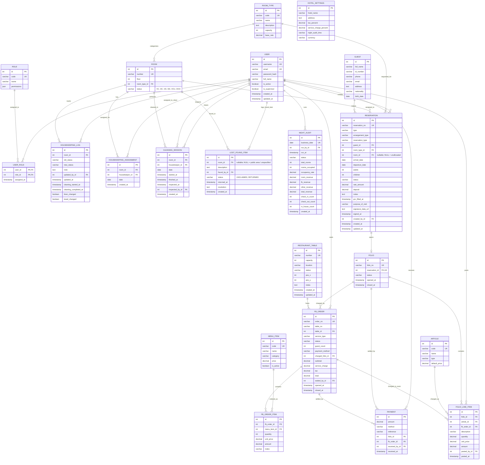

# Database Specification (MVP)

Database design for the ZADD Hotel Management MVP. Implemented in PostgreSQL with Prisma ORM. 21 tables organized across seven logical domains: authentication, master data, front office, food & beverage, housekeeping, accounting, and payment.

The source of truth for the schema itself is `prisma/schema.prisma`. This document describes the intent, relationships, and design decisions behind it.

---

## Entity Relationship Diagram

The ERD below shows all 21 entities and their relationships in crow's-foot notation. Render through [mermaid.live](https://mermaid.live) or any Mermaid-compatible viewer.

```mermaid
erDiagram
  USER ||--o{ USER_ROLE : "has"
  ROLE ||--o{ USER_ROLE : "assigned_to"
  USER ||--o{ HOUSEKEEPING_LOG : "performs"
  USER ||--o{ HOUSEKEEPING_ASSIGNMENT : "assigned_to_clean"
  USER ||--o{ CLEANING_SESSION : "cleans"
  USER ||--o{ CLEANING_SESSION : "inspects"
  USER ||--o{ LOST_FOUND_ITEM : "logs_found_item"
  USER ||--o{ NIGHT_AUDIT : "runs"
  USER ||--o{ PAYMENT : "receives"
  USER ||--o{ RESERVATION : "creates"
  USER ||--o{ FB_ORDER : "waits"
  USER ||--o{ FOLIO_LINE_ITEM : "posts"

  ROOM_TYPE ||--o{ ROOM : "categorizes"
  ROOM_TYPE ||--o{ RESERVATION : "requested_for"

  ROOM ||--o{ HOUSEKEEPING_LOG : "tracks"
  ROOM ||--o{ HOUSEKEEPING_ASSIGNMENT : "assigned_for"
  ROOM ||--o{ CLEANING_SESSION : "cleaned_in"
  ROOM ||--o{ LOST_FOUND_ITEM : "found_in"
  ROOM ||--o{ RESERVATION : "assigned_to"

  GUEST ||--o{ RESERVATION : "makes"
  RESERVATION ||--o| FOLIO : "opens"
  FOLIO ||--o{ FOLIO_LINE_ITEM : "contains"
  FOLIO ||--o{ PAYMENT : "settled_by"
  FOLIO ||--o{ FB_ORDER : "charged_by"

  ARTICLE ||--o{ FOLIO_LINE_ITEM : "charged_as"

  MENU_ITEM ||--o{ FB_ORDER_ITEM : "ordered_as"
  RESTAURANT_TABLE ||--o{ FB_ORDER : "hosts"
  FB_ORDER ||--o{ FB_ORDER_ITEM : "contains"
  FB_ORDER ||--o{ PAYMENT : "settled_by"
  FB_ORDER ||--o{ FOLIO_LINE_ITEM : "charged_to_room"

  USER {
    int id PK
    varchar username UK
    varchar email UK
    varchar password_hash
    varchar full_name
    boolean is_active
    boolean is_supervisor
    timestamp created_at
    timestamp updated_at
  }
  ROLE {
    int id PK
    varchar code UK
    varchar name
    json permissions
  }
  USER_ROLE {
    int user_id PK, FK
    int role_id PK, FK
    timestamp assigned_at
  }
  ROOM_TYPE {
    int id PK
    varchar code UK
    varchar name
    text description
    int capacity
    decimal base_rate
  }
  ROOM {
    int id PK
    varchar number UK
    int floor
    int room_type_id FK
    varchar status "VC, OC, VD, OD, VCU, OOO"
  }
  ARTICLE {
    int id PK
    varchar code UK
    varchar name
    varchar type
    decimal default_price
  }
  HOTEL_SETTINGS {
    int id PK
    varchar hotel_name
    text address
    decimal tax_percent
    decimal service_charge_percent
    varchar night_audit_time
    varchar currency
  }
  GUEST {
    int id PK
    varchar full_name
    varchar id_number
    varchar phone
    varchar email
    text address
    varchar nationality
    date birth_date
  }
  RESERVATION {
    int id PK
    varchar reservation_no UK
    varchar type
    varchar arrangement_type
    varchar reservation_type
    int guest_id FK
    int room_type_id FK
    int room_id FK "nullable; NULL = unallocated"
    date arrival_date
    date departure_date
    int adults
    int children
    varchar status
    decimal rate_amount
    decimal deposit
    text notes
    timestamp grc_filled_at
    varchar purpose_of_visit
    text signature_data_url
    timestamp signed_at
    int created_by_id FK
    timestamp created_at
    timestamp updated_at
  }
  FOLIO {
    int id PK
    varchar folio_no UK
    int reservation_id FK, UK
    varchar status
    timestamp opened_at
    timestamp closed_at
  }
  FOLIO_LINE_ITEM {
    int id PK
    int folio_id FK
    int article_id FK
    int fb_order_id FK
    varchar description
    decimal quantity
    decimal unit_price
    decimal amount
    int posted_by_id FK
    timestamp posted_at
  }
  MENU_ITEM {
    int id PK
    varchar code UK
    varchar name
    varchar category
    decimal price
    boolean is_active
  }
  RESTAURANT_TABLE {
    int id PK
    varchar number UK
    int capacity
    varchar location
    varchar status
    int pos_x
    int pos_y
    text notes
    timestamp created_at
    timestamp updated_at
  }
  FB_ORDER {
    int id PK
    varchar order_no UK
    varchar table_no
    int table_id FK
    varchar service_type
    varchar status
    int guest_count
    varchar payment_method
    int charged_folio_id FK
    decimal subtotal
    decimal service_charge
    decimal tax
    decimal total
    int waited_by_id FK
    timestamp opened_at
    timestamp closed_at
  }
  FB_ORDER_ITEM {
    int id PK
    int fb_order_id FK
    int menu_item_id FK
    int quantity
    decimal unit_price
    decimal amount
    varchar notes
  }
  HOUSEKEEPING_LOG {
    int id PK
    int room_id FK
    varchar old_status
    varchar new_status
    text note
    int updated_by_id FK
    timestamp updated_at
    timestamp cleaning_started_at
    timestamp cleaning_completed_at
    boolean linen_changed
    boolean towel_changed
  }
  HOUSEKEEPING_ASSIGNMENT {
    int id PK
    int room_id FK
    int housekeeper_id FK
    date date
    timestamp created_at
  }
  CLEANING_SESSION {
    int id PK
    int room_id FK
    int housekeeper_id FK
    date date
    timestamp started_at
    timestamp finished_at
    timestamp inspected_at
    int inspected_by_id FK
    timestamp created_at
  }
  LOST_FOUND_ITEM {
    int id PK
    int room_id FK "nullable; NULL = public area / unspecified"
    text description
    int found_by_id FK
    varchar status "UNCLAIMED, RETURNED"
    timestamp returned_at
    text resolution
    timestamp created_at
  }
  NIGHT_AUDIT {
    int id PK
    date business_date UK
    int run_by_id FK
    timestamp run_at
    varchar status
    int total_rooms
    int rooms_occupied
    decimal occupancy_rate
    decimal room_revenue
    decimal fb_revenue
    decimal other_revenue
    decimal total_revenue
    int check_in_count
    int check_out_count
    int in_house_count
    timestamp created_at
  }
  PAYMENT {
    int id PK
    decimal amount
    varchar method
    varchar reference
    int folio_id FK
    int fb_order_id FK
    int received_by_id FK
    timestamp received_at
  }
```

---

## Relational schema

Notation: `TableName(*pk*, *fk\#*, attr1, attr2, ...)`. Attributes marked with `*` are primary keys; those marked with `\#` are foreign keys.

**Authentication**

1. User(*id*, username, email, password_hash, full_name, is_active, is_supervisor, created_at, updated_at)
2. Role(*id*, code, name, permissions)
3. UserRole(*user_id\#*, *role_id\#*, assigned_at)

**Master data**

4. RoomType(*id*, code, name, description, capacity, base_rate)
5. Room(*id*, number, floor, *room_type_id\#*, status)
6. Article(*id*, code, name, type, default_price)
7. HotelSettings(*id*, hotel_name, address, tax_percent, service_charge_percent, night_audit_time, currency)

**Front Office**

8. Guest(*id*, full_name, id_number, phone, email, address, nationality, birth_date)
9. Reservation(*id*, reservation_no, type, arrangement_type, reservation_type, *guest_id\#*, *room_type_id\#*, room_id\# nullable, *created_by_id\#*, arrival_date, departure_date, adults, children, status, rate_amount, deposit, notes, grc_filled_at, purpose_of_visit, signature_data_url, signed_at, created_at, updated_at)
10. Folio(*id*, folio_no, *reservation_id\#*, status, opened_at, closed_at)
11. FolioLineItem(*id*, *folio_id\#*, *article_id\#*, *fb_order_id\#*, *posted_by_id\#*, description, quantity, unit_price, amount, posted_at)

**Food & Beverage**

12. MenuItem(*id*, code, name, category, price, is_active)
13. RestaurantTable(*id*, number, capacity, location, status, pos_x, pos_y, notes, created_at, updated_at)
14. FBOrder(*id*, order_no, *table_id\#*, *charged_folio_id\#*, *waited_by_id\#*, table_no, service_type, guest_count, status, payment_method, subtotal, service_charge, tax, total, opened_at, closed_at)
15. FBOrderItem(*id*, *fb_order_id\#*, *menu_item_id\#*, quantity, unit_price, amount, notes)

**Housekeeping**

16. HousekeepingLog(*id*, *room_id\#*, *updated_by_id\#*, old_status, new_status, note, updated_at, cleaning_started_at, cleaning_completed_at, linen_changed, towel_changed)
17. HousekeepingAssignment(*id*, *room_id\#*, *housekeeper_id\#*, date, created_at)
18. CleaningSession(*id*, *room_id\#*, *housekeeper_id\#*, inspected_by_id\# nullable, date, started_at, finished_at, inspected_at, created_at)
19. LostFoundItem(*id*, room_id\# nullable, *found_by_id\#*, description, status, returned_at, resolution, created_at)

**Accounting**

20. NightAudit(*id*, business_date, *run_by_id\#*, status, run_at, total_rooms, rooms_occupied, occupancy_rate, room_revenue, fb_revenue, other_revenue, total_revenue, check_in_count, check_out_count, in_house_count, created_at)

**Payment**

21. Payment(*id*, *folio_id\#*, *fb_order_id\#*, *received_by_id\#*, amount, method, reference, received_at)

---

## Enum specifications

| Enum | Values |
|---|---|
| RoomStatus | VC, OC, VD, OD, VCU, OOO |
| ArticleType | ROOM, FB, SERVICE, TAX, MISC |
| ReservationStatus | CONFIRMED, CHECKED_IN, CHECKED_OUT, CANCELLED, NO_SHOW |
| ReservationUsageType | REGULAR, WALK_IN |
| ArrangementType | RO, RB, FBM |
| ReservationType | INDIVIDUAL, COMPANY, GOVERNMENT, OTA, WALK_IN |
| FolioStatus | OPEN, CLOSED, VOIDED |
| FBOrderServiceType | DINE_IN, ROOM_SERVICE |
| FBOrderStatus | OPEN, BILLED, CLOSED, VOIDED |
| TableLocation | INDOOR, OUTDOOR, PRIVATE |
| TableStatus | AVAILABLE, OCCUPIED, RESERVED, OUT_OF_SERVICE |
| PaymentMethod | CASH, TRANSFER, CARD, CHARGE_TO_ROOM |
| NightAuditStatus | COMPLETED |
| LostFoundStatus | UNCLAIMED, RETURNED |

---

## Design decisions

A few choices worth explaining:

1. **Rate is inlined into RoomType.** In the MVP, each room type has a single fixed rate (`base_rate`). Dynamic rate plans with date validity and guest segmentation are deferred.
2. **Guest Registration Card (GRC) is inlined into Reservation.** The `grc_filled_at`, `purpose_of_visit`, `signature_data_url`, and `signed_at` fields live directly on Reservation because the relationship is at-most-one-to-one and GRC filling happens at check-in. The guest signature is stored as a PNG data URL in text, not as a file or blob upload.
3. **Rate snapshot on Reservation.** The `rate_amount` column captures the rate at booking time, so later changes to `base_rate` don't affect existing reservations.
4. **Payment is polymorphic.** Exactly one of `folio_id` or `fb_order_id` must be populated per Payment row. Enforced at the database level by `payment_exactly_one_owner_check`.
5. **Room.status is denormalized.** Current room status lives directly on the Room table to keep Kalender reads fast. HousekeepingLog is the audit trail of every status change.
6. **Cleaning workflow uses existing room statuses.** The room-status enum already covers the housekeeping flow: vacant rooms move `VD → VCU → VC`, while occupied-room cleaning moves `OD → OC`. No separate "in progress" status is stored; active cleaning is derived from `CleaningSession.started_at IS NOT NULL AND finished_at IS NULL`.
7. **CleaningSession is the workflow source.** CleaningSession stores per-room, per-housekeeper timestamps so cleaning duration (`finished_at - started_at`) and inspection history are preserved beyond the current Room status. HousekeepingLog timing/linen fields remain in the physical table as legacy audit payload columns, but the final HK module reads the cleaning lifecycle from CleaningSession.
8. **Reservation notes are canonical.** `Reservation.notes` is the single free-text reservation note. Front Office can edit it; Housekeeping reads it as guest instructions on HK worklists, cleaning cards, and room detail surfaces.
9. **Lost & Found is operationally independent.** LostFoundItem records text descriptions, optional room context, the user who logged the item, and return resolution. It does not create maintenance tickets, store photos, or change Room.status automatically.
10. **F&B charges appear as folio line items.** When an F&B bill is charge-to-room, a FolioLineItem row is created with `fb_order_id` populated, preserving the link between the folio and the originating F&B order.
11. **Room-type capacity has two meanings in operations.** `RoomType.capacity` is the maximum guest count for one room of that type. Reservation overbooking prevention instead uses the room type's inventory capacity: the count of physical `Room` rows registered for that type. A reservation must pass both checks.

---

## Table specifications

### `user`

| Attribute | Type | Constraint | Notes |
|---|---|---|---|
| id | SERIAL | PRIMARY KEY | Unique user identifier |
| username | VARCHAR(50) | UNIQUE, NOT NULL | Login username |
| email | VARCHAR(100) | UNIQUE | User email |
| password_hash | VARCHAR(255) | NOT NULL | Password hash (bcrypt) |
| full_name | VARCHAR(100) | NOT NULL | User's full name |
| is_active | BOOLEAN | NOT NULL, DEFAULT TRUE | Account active status |
| is_supervisor | BOOLEAN | NOT NULL, DEFAULT FALSE | Per-module elevated tier flag; role code remains unchanged |
| created_at | TIMESTAMP | NOT NULL, DEFAULT NOW() | Account creation time |
| updated_at | TIMESTAMP | NOT NULL | Last update time |

### `role`

| Attribute | Type | Constraint | Notes |
|---|---|---|---|
| id | SERIAL | PRIMARY KEY | Unique role identifier |
| code | VARCHAR(20) | UNIQUE, NOT NULL | Role code (FO, HK, FB, ACC, ADMIN) |
| name | VARCHAR(50) | NOT NULL | Role name |
| permissions | JSONB | NOT NULL | Per-module permission map |

### `user_role`

| Attribute | Type | Constraint | Notes |
|---|---|---|---|
| user_id | INT | PRIMARY KEY, FOREIGN KEY → user(id), ON DELETE CASCADE | User reference |
| role_id | INT | PRIMARY KEY, FOREIGN KEY → role(id), ON DELETE CASCADE | Role reference |
| assigned_at | TIMESTAMP | NOT NULL, DEFAULT NOW() | Role assignment time |

### `room_type`

| Attribute | Type | Constraint | Notes |
|---|---|---|---|
| id | SERIAL | PRIMARY KEY | Unique room type identifier |
| code | VARCHAR(20) | UNIQUE, NOT NULL | Type code (STD, DLX, SUP) |
| name | VARCHAR(50) | NOT NULL | Room type name |
| description | TEXT | — | Description |
| capacity | INT | NOT NULL | Max guest capacity per room. Reservation overbooking uses the count of physical room rows for this type as inventory capacity. |
| base_rate | DECIMAL(12,2) | NOT NULL | Base rate per night |

### `room`

| Attribute | Type | Constraint | Notes |
|---|---|---|---|
| id | SERIAL | PRIMARY KEY | Unique room identifier |
| number | VARCHAR(10) | UNIQUE, NOT NULL | Room number |
| floor | INT | NOT NULL | Floor number |
| room_type_id | INT | NOT NULL, FOREIGN KEY → room_type(id) | Room type reference |
| status | RoomStatus | NOT NULL, DEFAULT 'VC' | Room status (VC, OC, VD, OD, VCU, OOO). VCU means Vacant Clean Unchecked, waiting for HK inspection. |

### `article`

| Attribute | Type | Constraint | Notes |
|---|---|---|---|
| id | SERIAL | PRIMARY KEY | Unique article identifier |
| code | VARCHAR(20) | UNIQUE, NOT NULL | Charge code |
| name | VARCHAR(100) | NOT NULL | Charge name |
| type | ArticleType | NOT NULL | Type (ROOM, FB, SERVICE, TAX, MISC) |
| default_price | DECIMAL(12,2) | — | Default price (optional) |

### `hotel_settings`

| Attribute | Type | Constraint | Notes |
|---|---|---|---|
| id | INT | PRIMARY KEY, DEFAULT 1 | Singleton (always one row) |
| hotel_name | VARCHAR(100) | NOT NULL | Hotel name |
| address | TEXT | — | Hotel address |
| tax_percent | DECIMAL(5,2) | NOT NULL | Tax percentage |
| service_charge_percent | DECIMAL(5,2) | NOT NULL | Service charge percentage |
| night_audit_time | VARCHAR(5) | NOT NULL | Night audit cutoff (HH:MM) |
| currency | VARCHAR(5) | NOT NULL, DEFAULT 'IDR' | System currency |

### `guest`

| Attribute | Type | Constraint | Notes |
|---|---|---|---|
| id | SERIAL | PRIMARY KEY | Unique guest identifier |
| full_name | VARCHAR(100) | NOT NULL | Guest's full name |
| id_number | VARCHAR(50) | — | ID card / passport number |
| phone | VARCHAR(20) | — | Phone number |
| email | VARCHAR(100) | — | Email |
| address | TEXT | — | Address |
| nationality | VARCHAR(50) | — | Nationality |
| birth_date | DATE | — | Guest birth date |

### `reservation`

| Attribute | Type | Constraint | Notes |
|---|---|---|---|
| id | SERIAL | PRIMARY KEY | Unique reservation identifier |
| reservation_no | VARCHAR(20) | UNIQUE, NOT NULL | Reservation number |
| type | ReservationUsageType | NOT NULL, DEFAULT 'REGULAR' | Internal usage type: REGULAR, WALK_IN |
| arrangement_type | ArrangementType | NOT NULL, DEFAULT 'RO' | RO, RB, FBM |
| reservation_type | ReservationType | NOT NULL, DEFAULT 'INDIVIDUAL' | INDIVIDUAL, COMPANY, GOVERNMENT, OTA, WALK_IN |
| guest_id | INT | NOT NULL, FOREIGN KEY → guest(id) | Booking guest |
| room_type_id | INT | NOT NULL, FOREIGN KEY → room_type(id) | Room type booked |
| room_id | INT | NULLABLE, FOREIGN KEY → room(id), ON DELETE SET NULL | Physical room assigned at check-in; NULL means unallocated reservation |
| arrival_date | DATE | NOT NULL | Planned check-in date |
| departure_date | DATE | NOT NULL | Planned check-out date |
| adults | INT | NOT NULL, DEFAULT 1 | Adult guest count |
| children | INT | NOT NULL, DEFAULT 0 | Child guest count |
| status | ReservationStatus | NOT NULL, DEFAULT 'CONFIRMED' | CONFIRMED, CHECKED_IN, CHECKED_OUT, CANCELLED, NO_SHOW |
| rate_amount | DECIMAL(12,2) | NOT NULL | Rate snapshot at booking time |
| deposit | DECIMAL(12,2) | NOT NULL, DEFAULT 0 | Deposit paid |
| notes | TEXT | — | Canonical reservation note; FO edits it and HK reads it as guest instructions |
| grc_filled_at | TIMESTAMP | — | GRC completion time |
| purpose_of_visit | VARCHAR(100) | — | Purpose of visit (GRC field) |
| signature_data_url | TEXT | — | Guest signature as a PNG data URL captured during check-in |
| signed_at | TIMESTAMP | — | Guest signature capture time |
| created_by_id | INT | NOT NULL, FOREIGN KEY → user(id) | Staff who created the reservation |
| created_at | TIMESTAMP | NOT NULL, DEFAULT NOW() | Creation time |
| updated_at | TIMESTAMP | NOT NULL | Last update time |

### `folio`

| Attribute | Type | Constraint | Notes |
|---|---|---|---|
| id | SERIAL | PRIMARY KEY | Unique folio identifier |
| folio_no | VARCHAR(20) | UNIQUE, NOT NULL | Folio number |
| reservation_id | INT | UNIQUE, NOT NULL, FOREIGN KEY → reservation(id) | Associated reservation |
| status | FolioStatus | NOT NULL, DEFAULT 'OPEN' | OPEN, CLOSED, VOIDED |
| opened_at | TIMESTAMP | NOT NULL, DEFAULT NOW() | Folio opened time |
| closed_at | TIMESTAMP | — | Folio closed time |

### `folio_line_item`

| Attribute | Type | Constraint | Notes |
|---|---|---|---|
| id | SERIAL | PRIMARY KEY | Unique line item identifier |
| folio_id | INT | NOT NULL, FOREIGN KEY → folio(id) | Target folio |
| article_id | INT | NOT NULL, FOREIGN KEY → article(id) | Article (charge code) |
| fb_order_id | INT | FOREIGN KEY → fb_order(id), ON DELETE SET NULL | F&B order (if charge to room) |
| description | VARCHAR(255) | NOT NULL | Item description |
| quantity | DECIMAL(8,2) | NOT NULL, DEFAULT 1 | Quantity |
| unit_price | DECIMAL(12,2) | NOT NULL | Unit price |
| amount | DECIMAL(12,2) | NOT NULL | Total (quantity × unit_price) |
| posted_by_id | INT | NOT NULL, FOREIGN KEY → user(id) | Posting staff |
| posted_at | TIMESTAMP | NOT NULL, DEFAULT NOW() | Posting time |

### `menu_item`

| Attribute | Type | Constraint | Notes |
|---|---|---|---|
| id | SERIAL | PRIMARY KEY | Unique menu item identifier |
| code | VARCHAR(20) | UNIQUE, NOT NULL | Menu code |
| name | VARCHAR(100) | NOT NULL | Menu name |
| category | VARCHAR(50) | NOT NULL | Category (Main, Beverage, Dessert, etc.) |
| price | DECIMAL(12,2) | NOT NULL | Selling price |
| is_active | BOOLEAN | NOT NULL, DEFAULT TRUE | Active status |

### `restaurant_table`

| Attribute | Type | Constraint | Notes |
|---|---|---|---|
| id | SERIAL | PRIMARY KEY | Unique restaurant table identifier |
| number | VARCHAR(10) | UNIQUE, NOT NULL | Table number/code (for example T1) |
| capacity | INT | NOT NULL, DEFAULT 2 | Default seating capacity |
| location | TableLocation | NOT NULL, DEFAULT 'INDOOR' | INDOOR, OUTDOOR, PRIVATE |
| status | TableStatus | NOT NULL, DEFAULT 'AVAILABLE' | AVAILABLE, OCCUPIED, RESERVED, OUT_OF_SERVICE |
| pos_x | INT | NOT NULL, DEFAULT 0 | Layout X coordinate (Prisma `posX`, mapped to `pos_x`) |
| pos_y | INT | NOT NULL, DEFAULT 0 | Layout Y coordinate (Prisma `posY`, mapped to `pos_y`) |
| notes | TEXT | — | Operational notes |
| created_at | TIMESTAMP | NOT NULL, DEFAULT NOW() | Creation time |
| updated_at | TIMESTAMP | NOT NULL | Last update time |

### `fb_order`

| Attribute | Type | Constraint | Notes |
|---|---|---|---|
| id | SERIAL | PRIMARY KEY | Unique order identifier |
| order_no | VARCHAR(20) | UNIQUE, NOT NULL | Order number |
| table_id | INT | FOREIGN KEY → restaurant_table(id), ON DELETE SET NULL | Assigned restaurant table; nullable for room service |
| table_no | VARCHAR(10) | — | Legacy/free-text table number |
| service_type | FBOrderServiceType | NOT NULL, DEFAULT 'DINE_IN' | DINE_IN orders use restaurant tables; ROOM_SERVICE orders are tableless and charged to an in-house folio |
| guest_count | INT | NOT NULL, DEFAULT 1 | Guest count/pax |
| status | FBOrderStatus | NOT NULL, DEFAULT 'OPEN' | OPEN, BILLED, CLOSED, VOIDED |
| payment_method | PaymentMethod | — | CASH, TRANSFER, CARD, CHARGE_TO_ROOM (set at billing) |
| charged_folio_id | INT | FOREIGN KEY → folio(id), ON DELETE SET NULL | Target folio for charge-to-room |
| subtotal | DECIMAL(12,2) | NOT NULL, DEFAULT 0 | Subtotal before SC and tax |
| service_charge | DECIMAL(12,2) | NOT NULL, DEFAULT 0 | Service charge |
| tax | DECIMAL(12,2) | NOT NULL, DEFAULT 0 | Tax |
| total | DECIMAL(12,2) | NOT NULL, DEFAULT 0 | Total payable |
| waited_by_id | INT | NOT NULL, FOREIGN KEY → user(id) | Serving waiter |
| opened_at | TIMESTAMP | NOT NULL, DEFAULT NOW() | Order opened time |
| closed_at | TIMESTAMP | — | Order closed time |

### `fb_order_item`

| Attribute | Type | Constraint | Notes |
|---|---|---|---|
| id | SERIAL | PRIMARY KEY | Unique item identifier |
| fb_order_id | INT | NOT NULL, FOREIGN KEY → fb_order(id), ON DELETE CASCADE | Containing order |
| menu_item_id | INT | NOT NULL, FOREIGN KEY → menu_item(id) | Menu item ordered |
| quantity | INT | NOT NULL | Quantity |
| unit_price | DECIMAL(12,2) | NOT NULL | Unit price at order time |
| amount | DECIMAL(12,2) | NOT NULL | Total |
| notes | VARCHAR(255) | — | Kitchen notes |

### `housekeeping_log`

| Attribute | Type | Constraint | Notes |
|---|---|---|---|
| id | SERIAL | PRIMARY KEY | Unique log identifier |
| room_id | INT | NOT NULL, FOREIGN KEY → room(id) | Updated room |
| old_status | RoomStatus | NOT NULL | Status before update |
| new_status | RoomStatus | NOT NULL | Status after update |
| note | TEXT | — | Staff note |
| updated_by_id | INT | NOT NULL, FOREIGN KEY → user(id) | HK staff who updated |
| updated_at | TIMESTAMP | NOT NULL, DEFAULT NOW() | Update time |
| cleaning_started_at | TIMESTAMP | — | Legacy audit payload column; current cleaning timing is sourced from `cleaning_session.started_at` |
| cleaning_completed_at | TIMESTAMP | — | Legacy audit payload column; current cleaning timing is sourced from `cleaning_session.finished_at` |
| linen_changed | BOOLEAN | NOT NULL, DEFAULT FALSE | Legacy operational-capture column; not part of the final HK screen flow |
| towel_changed | BOOLEAN | NOT NULL, DEFAULT FALSE | Legacy operational-capture column; not part of the final HK screen flow |

### `housekeeping_assignment`

| Attribute | Type | Constraint | Notes |
|---|---|---|---|
| id | SERIAL | PRIMARY KEY | Unique assignment identifier |
| room_id | INT | NOT NULL, FOREIGN KEY → room(id) | Room assigned for cleaning |
| housekeeper_id | INT | NOT NULL, FOREIGN KEY → user(id) | Assigned HK user |
| date | DATE | NOT NULL | Cleaning date |
| created_at | TIMESTAMP | NOT NULL, DEFAULT NOW() | Assignment creation time |

Indexes and constraints:

- UNIQUE (`room_id`, `date`) — one assignee per room per day.
- INDEX (`housekeeper_id`, `date`) — daily assignment lookup per housekeeper.
- INDEX (`date`) — daily housekeeping board lookup.

### `cleaning_session`

| Attribute | Type | Constraint | Notes |
|---|---|---|---|
| id | SERIAL | PRIMARY KEY | Unique cleaning session identifier |
| room_id | INT | NOT NULL, FOREIGN KEY → room(id) | Room being cleaned |
| housekeeper_id | INT | NOT NULL, FOREIGN KEY → user(id) | HK user doing the cleaning |
| date | DATE | NOT NULL | Cleaning date |
| started_at | TIMESTAMP | — | Cleaning start time |
| finished_at | TIMESTAMP | — | Cleaning finish time |
| inspected_at | TIMESTAMP | — | Inspection time |
| inspected_by_id | INT | FOREIGN KEY → user(id), ON DELETE SET NULL | Inspector user, if inspected |
| created_at | TIMESTAMP | NOT NULL, DEFAULT NOW() | Session record creation time |

Indexes:

- INDEX (`room_id`) — room history lookup.
- INDEX (`housekeeper_id`, `date`) — daily work history per housekeeper.

Active cleaning is derived from `started_at` being set while `finished_at` is null. Cleaning duration is derived from `finished_at - started_at`.

### `lost_found_item`

| Attribute | Type | Constraint | Notes |
|---|---|---|---|
| id | SERIAL | PRIMARY KEY | Unique lost-and-found item identifier |
| room_id | INT | FOREIGN KEY -> room(id), ON DELETE SET NULL | Room where item was found, if applicable |
| description | TEXT | NOT NULL | Text description of the item |
| found_by_id | INT | NOT NULL, FOREIGN KEY -> user(id) | User who logged the found item |
| status | LostFoundStatus | NOT NULL, DEFAULT 'UNCLAIMED' | Whether the item is still held or has been returned |
| returned_at | TIMESTAMP | — | Return/resolution time |
| resolution | TEXT | — | Free-text claimant or resolution note |
| created_at | TIMESTAMP | NOT NULL, DEFAULT NOW() | Item log time |

Indexes:

- INDEX (`status`) — unclaimed/returned list filtering.
- INDEX (`room_id`) — room search/filter lookup.

Lost & Found is text-only in the MVP. Records may be room-specific or public-area items (`room_id` null). Marking an item returned stores `returned_at` and optional `resolution`; it does not mutate room status or create maintenance work.

### `night_audit`

| Attribute | Type | Constraint | Notes |
|---|---|---|---|
| id | SERIAL | PRIMARY KEY | Unique night audit identifier |
| business_date | DATE | UNIQUE, NOT NULL | Business date closed |
| status | NightAuditStatus | NOT NULL, DEFAULT 'COMPLETED' | Audit status |
| run_at | TIMESTAMP | NOT NULL, DEFAULT NOW() | Execution time |
| run_by_id | INT | NOT NULL, FOREIGN KEY → user(id) | Night auditor |
| total_rooms | INT | NOT NULL | Rooms in inventory at audit time |
| rooms_occupied | INT | NOT NULL | Occupied rooms at audit time |
| occupancy_rate | DECIMAL(5,2) | NOT NULL | Occupancy rate (%) |
| room_revenue | DECIMAL(14,2) | NOT NULL | Room revenue snapshot |
| fb_revenue | DECIMAL(14,2) | NOT NULL | F&B revenue snapshot |
| other_revenue | DECIMAL(14,2) | NOT NULL | Other revenue snapshot |
| total_revenue | DECIMAL(14,2) | NOT NULL | Total revenue for the day |
| check_in_count | INT | NOT NULL | Arrival/check-in count snapshot |
| check_out_count | INT | NOT NULL | Departure/check-out count snapshot |
| in_house_count | INT | NOT NULL | In-house guest count snapshot |
| created_at | TIMESTAMP | NOT NULL, DEFAULT NOW() | Record creation time |

> **Night Audit lock**: `business_date` is unique for the shipped daily-close flow. The app stores the completed snapshot for the WIB hotel date and relies on this constraint to prevent duplicate audits for the same business date.

### `payment`

| Attribute | Type | Constraint | Notes |
|---|---|---|---|
| id | SERIAL | PRIMARY KEY | Unique payment identifier |
| amount | DECIMAL(12,2) | NOT NULL | Payment amount |
| method | PaymentMethod | NOT NULL | CASH, TRANSFER, CARD, CHARGE_TO_ROOM |
| reference | VARCHAR(100) | — | Reference number (bank ref, card last 4) |
| folio_id | INT | FOREIGN KEY → folio(id), ON DELETE SET NULL | Folio paid (optional) |
| fb_order_id | INT | FOREIGN KEY → fb_order(id), ON DELETE SET NULL | F&B order paid (optional) |
| received_by_id | INT | NOT NULL, FOREIGN KEY → user(id) | Receiving staff |
| received_at | TIMESTAMP | NOT NULL, DEFAULT NOW() | Payment time |

> **Polymorphic constraint on Payment**: exactly one of `folio_id` or `fb_order_id` must be populated (`payment_exactly_one_owner_check`).
