# User Manual — ZADD Hotel Management

**Nama Kelompok:** ............................................................

**NIM / Nama Anggota:**

1. ............................................................
2. ............................................................
3. ............................................................
4. ............................................................
5. ............................................................

**Program Studi D3 Teknologi Rekayasa Perangkat Lunak Aplikasi**  
**Fakultas Ilmu Terapan**  
**Universitas Telkom**

**Bandung 2026**

---

## Pendahuluan

### Tentang Aplikasi

ZADD Hotel Management adalah aplikasi Property Management System berbasis web untuk membantu operasional hotel. Aplikasi ini mencakup proses Front Office, Housekeeping, Food & Beverage, Accounting, dan Admin dalam satu sistem terpadu.

### Tujuan Manual Book

Manual book ini membantu pengguna memahami langkah dasar penggunaan aplikasi sesuai role masing-masing. Dokumen ini juga menjadi panduan singkat saat praktik operasional hotel.

### Audiens

- Front Office
- Housekeeping
- Supervisor Housekeeping
- Food & Beverage
- Akuntansi
- Admin

### Cara Login

1. Buka halaman login ZADD Hotel Management.

   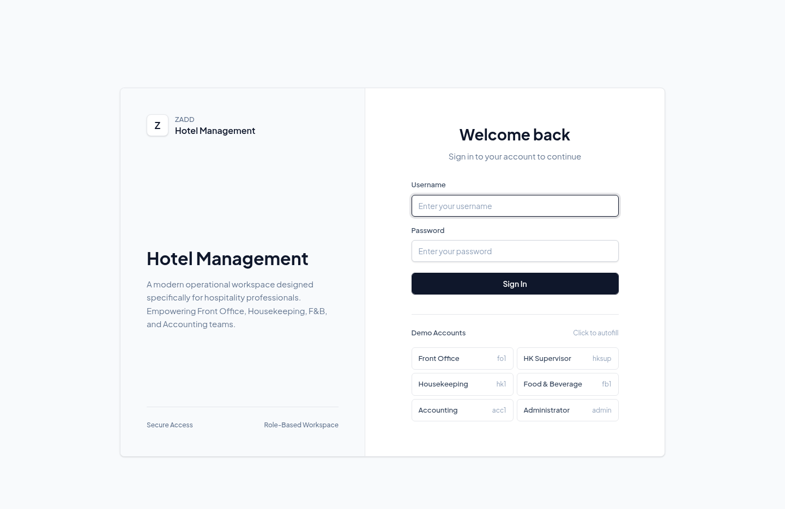

   Masukkan username dan password sesuai role. Untuk praktik, gunakan akun demo yang disediakan oleh pengajar atau tim pengembang.

2. Setelah login berhasil, sistem menampilkan halaman sesuai role pengguna.

## Front Office

Front Office menangani reservasi, check-in, folio tamu, pembayaran akhir, dan check-out.

### 1. Melihat Dashboard Front Office

1. Buka menu **Dashboard**.

   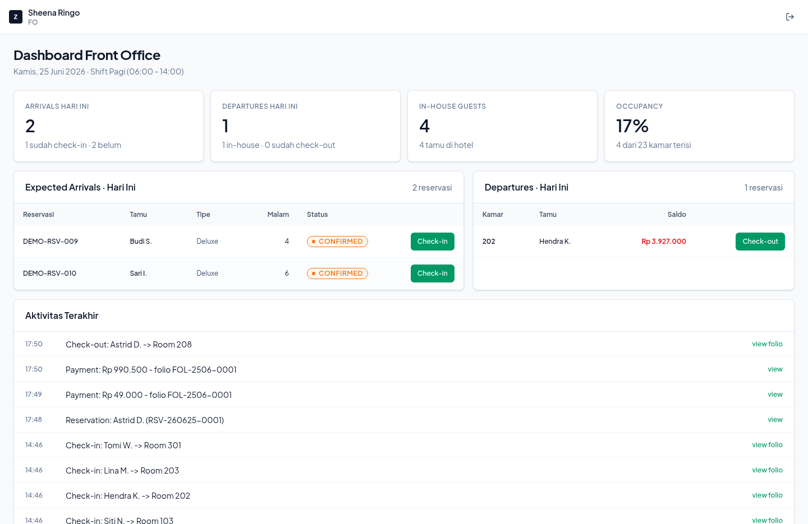

   Dashboard menampilkan Expected Arrivals, Departures hari ini, dan aktivitas terbaru. Gunakan daftar ini untuk memilih tamu yang akan check-in atau check-out.

### 2. Buat Reservasi

1. Klik **Reservasi**, lalu pilih **Tambah Reservasi**.

   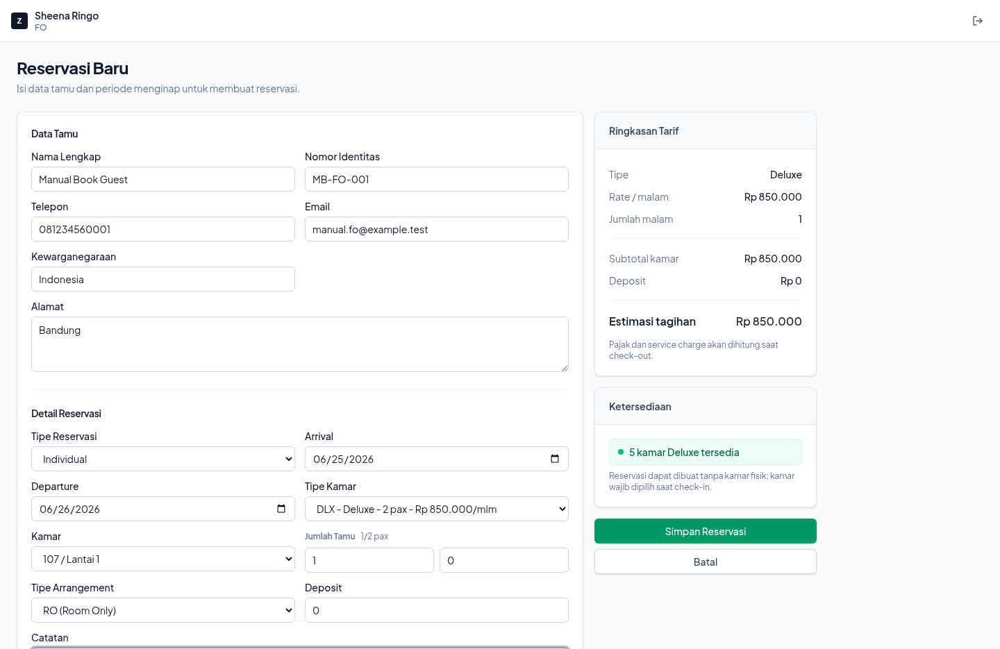

   Isi data tamu, tanggal arrival/departure, tipe kamar, kamar, jumlah tamu, deposit jika ada, dan catatan.

2. Klik **Simpan Reservasi**.

   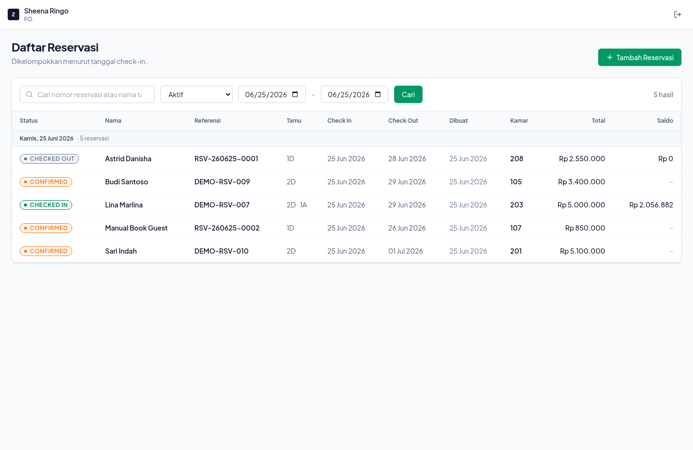

   Reservasi baru muncul di daftar reservasi dengan status **CONFIRMED**. Klik baris reservasi untuk membuka detail dan melanjutkan check-in.

### 3. Proses Check-in

1. Dari detail reservasi, klik **Check In Guest**.

   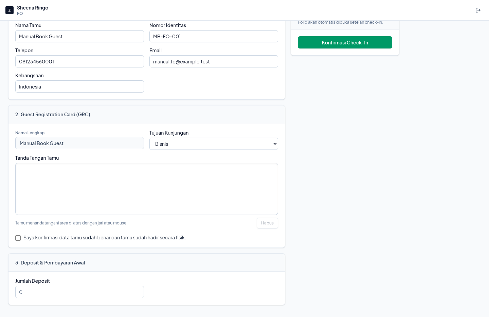

   Pastikan kamar, data tamu, dan Guest Registration Card sudah benar sebelum melanjutkan.

2. Minta tamu menandatangani area **Tanda Tangan Tamu**, lalu centang konfirmasi kedatangan.

   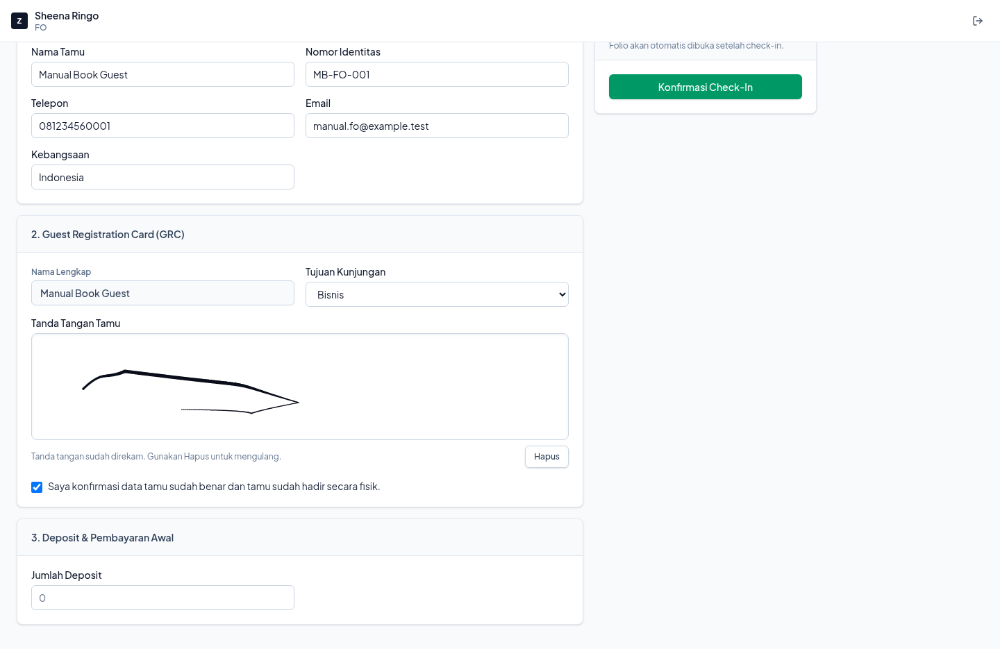

   Setelah tanda tangan terekam, klik **Konfirmasi Check-In**. Sistem membuat Guest Folio untuk tamu.

### 4. Kelola Guest Folio

1. Buka Guest Folio setelah check-in selesai.

   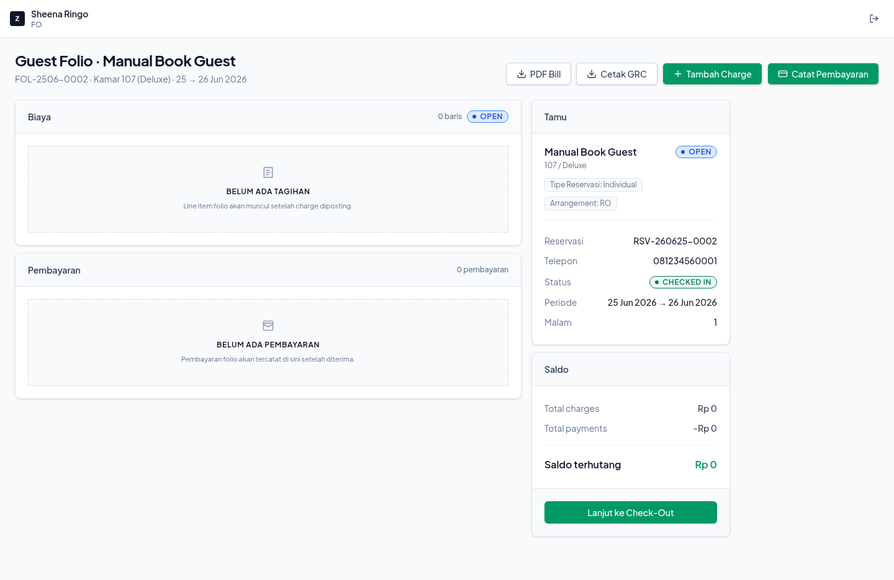

   Folio menampilkan daftar biaya, pembayaran, dan tombol untuk menambah charge atau mencatat pembayaran.

2. Klik **Tambah Charge** jika ada biaya tambahan.

   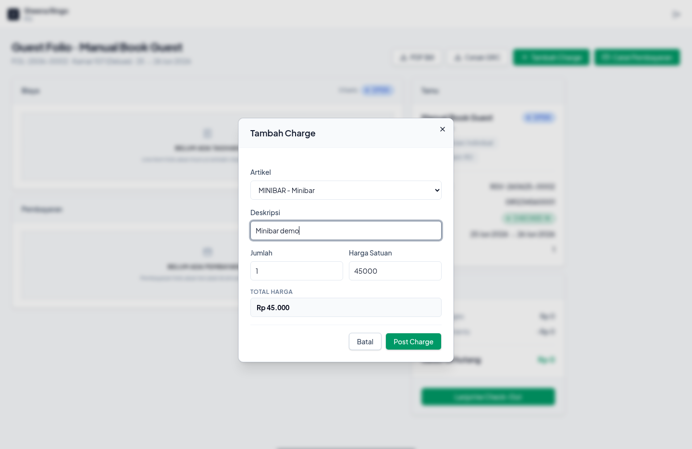

   Pilih artikel, isi deskripsi bila perlu, periksa jumlah dan harga, lalu klik **Post Charge**.

3. Periksa folio setelah charge diposting.

   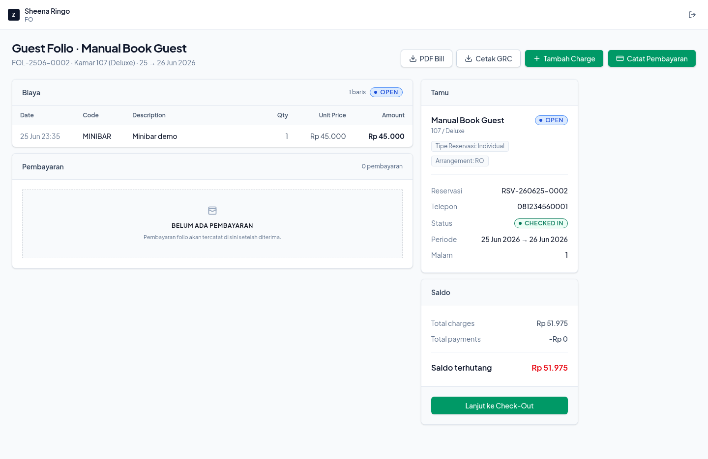

   Biaya yang sudah diposting muncul pada tabel **Biaya** dan menambah saldo folio.

### 5. Proses Check-out

1. Klik **Lanjut ke Check-Out** dari halaman folio.

   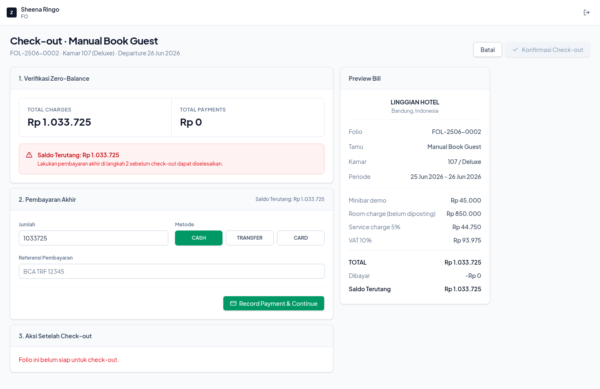

   Jika masih ada **Saldo Terutang**, tombol konfirmasi check-out terkunci. Catat pembayaran akhir terlebih dahulu.

2. Pada bagian **Pembayaran Akhir**, periksa jumlah pembayaran dan klik **Record Payment & Continue**.

   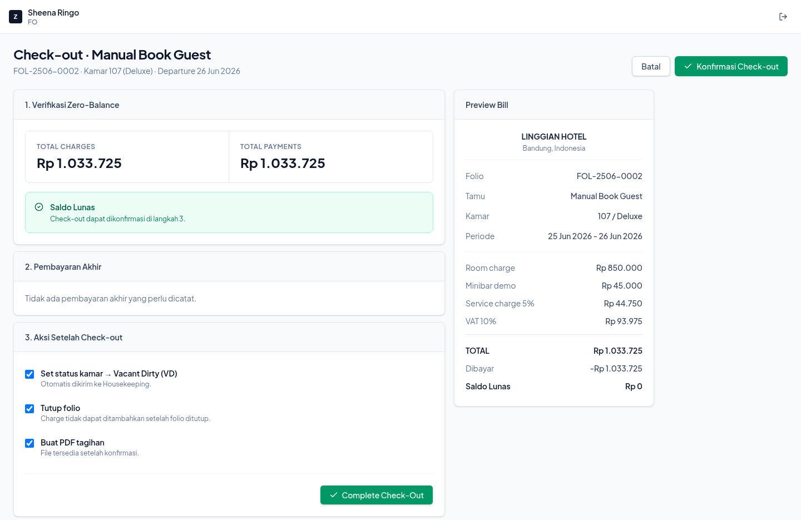

   Setelah saldo menjadi zero-balance, sistem membuka langkah aksi setelah check-out.

3. Pastikan opsi setelah check-out sudah dicentang, lalu klik **Complete Check-Out**.

   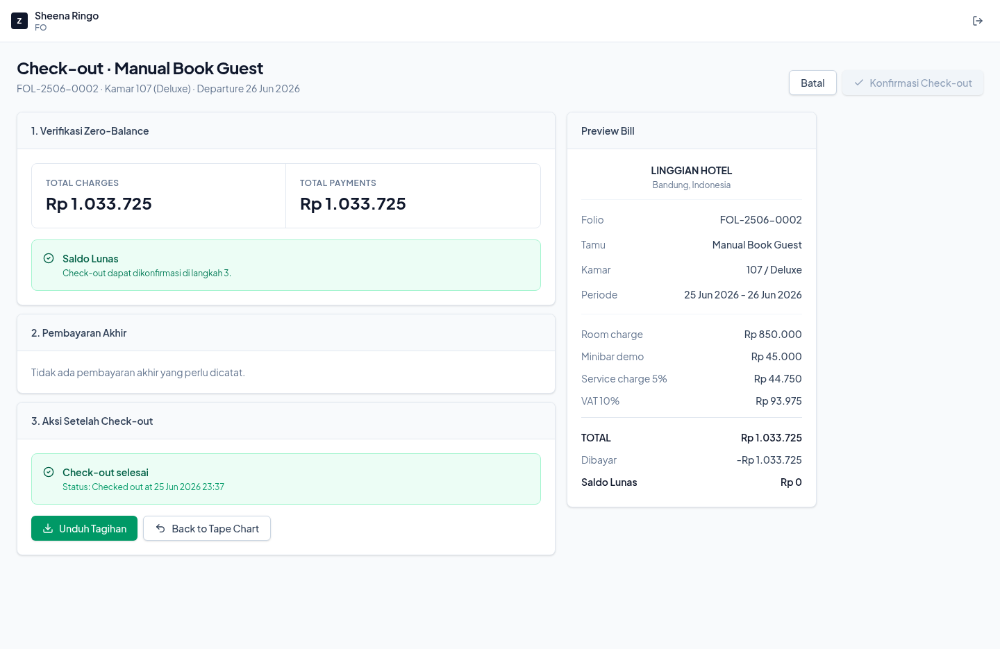

   Check-out selesai. Sistem menyediakan tautan **Unduh Tagihan** dan **Back to Tape Chart**.

## Housekeeping

TODO: Isi bagian Housekeeping setelah template Front Office disetujui.

## Supervisor Housekeeping

TODO: Isi bagian Supervisor Housekeeping setelah template Front Office disetujui.

## Food & Beverage

TODO: Isi bagian Food & Beverage setelah template Front Office disetujui.

## Akuntansi

TODO: Isi bagian Akuntansi setelah template Front Office disetujui.

## Admin

TODO: Isi bagian Admin setelah template Front Office disetujui.
